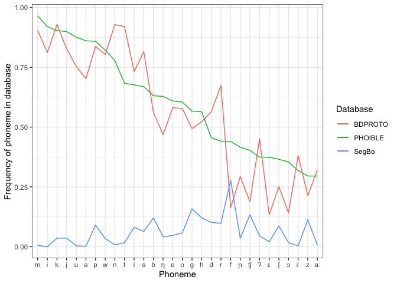
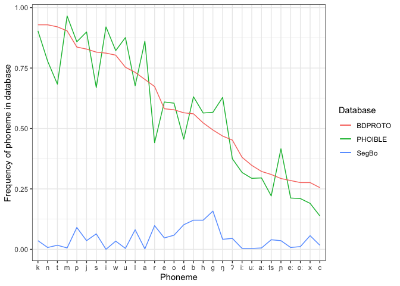
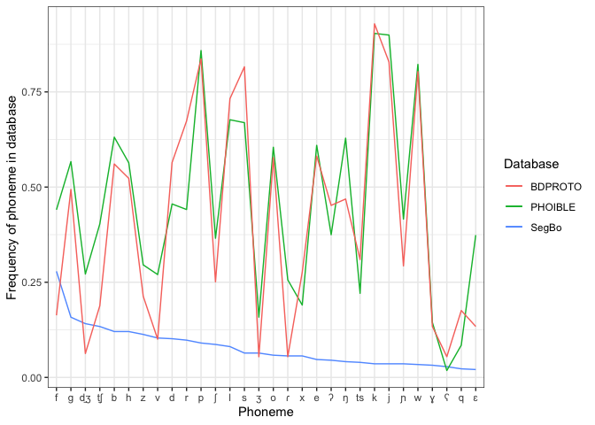

Comparison of segment frequencies in BDPROTO, PHOIBLE and SegBo
================
Steven Moran

04 October, 2020

Overview
========

Plot the raw frequency distributions from the three databases.

Load some R libraries.

    library(tidyverse)

    ## ── Attaching packages ───────────────────────────────────────────────────────────────────────────── tidyverse 1.3.0 ──

    ## ✓ ggplot2 3.3.2     ✓ purrr   0.3.4
    ## ✓ tibble  3.0.3     ✓ dplyr   1.0.0
    ## ✓ tidyr   1.1.0     ✓ stringr 1.4.0
    ## ✓ readr   1.3.1     ✓ forcats 0.5.0

    ## ── Conflicts ──────────────────────────────────────────────────────────────────────────────── tidyverse_conflicts() ──
    ## x dplyr::filter() masks stats::filter()
    ## x dplyr::lag()    masks stats::lag()

    library(knitr)

Load the aggregated and transformed data created by the [data
preparation report](../data_preparation/data_prep.md).

    load('../data_preparation/dfs_for_analysis_csv_vs.RData')

The `all_segments_long` table looks like this:

    all_segments_long %>% head() %>% kable()

| Phoneme | phoible | bdproto | segbo | phoible\_prob | bdproto\_prob | segbo\_prob | phoible\_freq | bdproto\_freq | segbo\_freq |
|:--------|--------:|--------:|------:|--------------:|--------------:|------------:|--------------:|--------------:|------------:|
| m       |    2915 |     216 |     3 |     0.0276408 |     0.0308131 |   0.0018007 |     0.9652318 |     0.9037657 |   0.0056497 |
| i       |    2779 |     194 |     0 |     0.0263512 |     0.0276748 |   0.0000000 |     0.9201987 |     0.8117155 |   0.0000000 |
| k       |    2729 |     222 |    19 |     0.0258771 |     0.0316690 |   0.0114046 |     0.9036424 |     0.9288703 |   0.0357815 |
| j       |    2716 |     198 |    19 |     0.0257538 |     0.0282454 |   0.0114046 |     0.8993377 |     0.8284519 |   0.0357815 |
| u       |    2646 |     180 |     2 |     0.0250901 |     0.0256776 |   0.0012005 |     0.8761589 |     0.7531381 |   0.0037665 |
| a       |    2600 |     168 |     1 |     0.0246539 |     0.0239658 |   0.0006002 |     0.8609272 |     0.7029289 |   0.0018832 |

The table is already ordered by PHOIBLE segment frequency, but R needs
it sorted as factor to plot it sorted.

    all_segments_long$Phoneme <- factor(all_segments_long$Phoneme, levels=all_segments_long$Phoneme[order(-all_segments_long$phoible)])

Plots
=====

Let’s plot the top top 30 most frequent phonemes in PHOIBLE.

    top.z <- head(all_segments_long, n=30)

    ggplot(data = top.z, aes(x = Phoneme, group=1)) +
      geom_line(aes(y = phoible_freq, color = "PHOIBLE")) + 
      geom_line(aes(y = bdproto_freq, color = "BDPROTO")) +
      geom_line(aes(y = segbo_freq, color = "SegBo")) +
      ylab("Frequency of phoneme in database") +
      # xlab("Thirty most frequent phonemes as reported in PHOIBLE") +
      labs(color="Database") +
      theme_bw()

<!-- -->

Get the most frequent phonemes in BDPROTO and plot them against PHOIBLE.

    bdproto_top <- all_segments_long %>% arrange(desc(bdproto))

Ordered as factors for plotting.

    bdproto_top$Phoneme <- factor(bdproto_top$Phoneme, levels=bdproto_top$Phoneme[order(-bdproto_top$bdproto)])

    top.z <- head(bdproto_top, n=30)

    ggplot(data = top.z, aes(x = Phoneme, group=1)) +
      geom_line(aes(y = phoible_freq, color = "PHOIBLE")) + 
      geom_line(aes(y = bdproto_freq, color = "BDPROTO")) +
      geom_line(aes(y = segbo_freq, color = "SegBo")) +
      ylab("Frequency of phoneme in database") +
      # xlab("Thirty most frequent phonemes as reported in BDPROTO") +
      labs(color="Database") +
      theme_bw()

<!-- -->

      # theme(legend.position = "none") 

Get the most frequent phonemes in SegBo and plot them against PHOIBLE
and BDPROTO.

    segbo_top <- all_segments_long %>% arrange(desc(segbo))

Ordered as factors for plotting.

    segbo_top$Phoneme <- factor(segbo_top$Phoneme, levels=segbo_top$Phoneme[order(-segbo_top$segbo)])

    top.z <- head(segbo_top, n=30)

    ggplot(data = top.z, aes(x = Phoneme, group=1)) +
      geom_line(aes(y = segbo_freq, color = "SegBo")) +
      geom_line(aes(y = phoible_freq, color = "PHOIBLE")) + 
      geom_line(aes(y = bdproto_freq, color = "BDPROTO")) +

      ylab("Frequency of phoneme in database") +
      # xlab("Thirty most frequent phonemes as reported in BDPROTO") +
      labs(color="Database") +
      theme_bw()

<!-- -->

      # theme(legend.position = "none") 

Tables
======

Let’s generate a summary table for the paper that includes the number of
languages, language families, and total segments in each database.

    # Get number of phonological inventories
    phoible_ids <- all_dbs_all_segments %>% filter(Database=="phoible") %>% select(InventoryID) %>% group_by(InventoryID) %>% summarize(n=n())

    ## `summarise()` ungrouping output (override with `.groups` argument)

    phoible_num_ids <- nrow(phoible_ids)

    bdproto_ids <- all_dbs_all_segments %>% filter(Database=="bdproto") %>% select(InventoryID) %>% group_by(InventoryID) %>% summarize(n=n())

    ## `summarise()` ungrouping output (override with `.groups` argument)

    bdproto_num_ids <- nrow(bdproto_ids)

    segbo_ids <- all_dbs_all_segments %>% filter(Database=="segbo") %>% select(InventoryID) %>% group_by(InventoryID) %>% summarize(n=n())

    ## `summarise()` ungrouping output (override with `.groups` argument)

    segbo_num_ids <- nrow(segbo_ids)

    # Generate segment counts
    phoible_segments <- all_dbs_all_segments %>% filter(Database=="phoible") %>% select(Phoneme) %>% group_by(Phoneme) %>% summarize(n=n())

    ## `summarise()` ungrouping output (override with `.groups` argument)

    phoible_num_segments <- nrow(phoible_segments)

    bdproto_segments <- all_dbs_all_segments %>% filter(Database=="bdproto") %>% select(Phoneme) %>% group_by(Phoneme) %>% summarize(n=n())

    ## `summarise()` ungrouping output (override with `.groups` argument)

    bdproto_num_segments <- nrow(bdproto_segments)

    segbo_segments <- all_dbs_all_segments %>% filter(Database=="segbo") %>% select(Phoneme) %>% group_by(Phoneme) %>% summarize(n=n())

    ## `summarise()` ungrouping output (override with `.groups` argument)

    segbo_num_segments <- nrow(segbo_segments)

    # Generate language family counts based on unique Glottocodes
    phoible_langs <- all_dbs_all_segments %>% filter(Database=="phoible") %>% select(Glottocode) %>% group_by(Glottocode) %>% summarize(n=n())

    ## `summarise()` ungrouping output (override with `.groups` argument)

    phoible_num_langs <- nrow(phoible_langs)

    bdproto_langs <- all_dbs_all_segments %>% filter(Database=="bdproto") %>% select(Glottocode) %>% group_by(Glottocode) %>% summarize(n=n())

    ## `summarise()` ungrouping output (override with `.groups` argument)

    bdproto_num_langs <- nrow(bdproto_langs)

    segbo_langs <- all_dbs_all_segments %>% filter(Database=="segbo") %>% select(Glottocode) %>% group_by(Glottocode) %>% summarize(n=n())

    ## `summarise()` ungrouping output (override with `.groups` argument)

    segbo_num_langs <- nrow(segbo_langs)

    # Generate language counts based on unique Glottocodes (language varieties)
    phoible_lang_fams <- all_dbs_all_segments %>% filter(Database=="phoible") %>% select(family_id) %>% group_by(family_id) %>% summarize(n=n())

    ## `summarise()` ungrouping output (override with `.groups` argument)

    phoible_num_lang_fams <- nrow(phoible_lang_fams)

    bdproto_lang_fams <- all_dbs_all_segments %>% filter(Database=="bdproto") %>% select(family_id) %>% group_by(family_id) %>% summarize(n=n())

    ## `summarise()` ungrouping output (override with `.groups` argument)

    bdproto_num_lang_fams <- nrow(bdproto_lang_fams)

    segbo_lang_fams <- all_dbs_all_segments %>% filter(Database=="segbo") %>% select(family_id) %>% group_by(family_id) %>% summarize(n=n())

    ## `summarise()` ungrouping output (override with `.groups` argument)

    segbo_num_lang_fams <- nrow(segbo_lang_fams)

Create the table.

    Database <- c("BDPROTO", "PHOIBLE", "SegBo")
    inventories <- c(bdproto_num_ids, phoible_num_ids, segbo_num_ids)
    langs <- c(bdproto_num_langs, phoible_num_langs, segbo_num_langs)
    fams <- c(bdproto_num_lang_fams, phoible_num_lang_fams, segbo_num_lang_fams)
    segments <- c(bdproto_num_segments, phoible_num_segments, segbo_num_segments)
    t <- data.frame(Database, inventories, langs, fams, segments)
    colnames(t) <- c('Database', 'Phonological inventories', 'Language varieties', 'Language families', 'Segment types')
    t %>% kable()

| Database | Phonological inventories | Language varieties | Language families | Segment types |
|:---------|-------------------------:|-------------------:|------------------:|--------------:|
| BDPROTO  |                      231 |                192 |                75 |           637 |
| PHOIBLE  |                     2808 |               2017 |               174 |          3064 |
| SegBo    |                      531 |                514 |               113 |           219 |

Let’s dump it to LaTeX for the paper.

    library(xtable)
    print(xtable(t), include.rownames=FALSE)

    ## % latex table generated in R 4.0.2 by xtable 1.8-4 package
    ## % Sun Oct  4 10:23:46 2020
    ## \begin{table}[ht]
    ## \centering
    ## \begin{tabular}{lrrrr}
    ##   \hline
    ## Database & Phonological inventories & Language varieties & Language families & Segment types \\ 
    ##   \hline
    ## BDPROTO & 231 & 192 &  75 & 637 \\ 
    ##   PHOIBLE & 2808 & 2017 & 174 & 3064 \\ 
    ##   SegBo & 531 & 514 & 113 & 219 \\ 
    ##    \hline
    ## \end{tabular}
    ## \end{table}
