JSD\_testing
================
Nicholas Lester
9/24/2020

### Summary

This file analyzes and compares the distributions of phonemes in three
databases: BDPROTO (ancient attested/reconstructed languages), PHOIBLE
(modern languages), and SegBo (segments known to be borrowed into
inventories).

In **Section 1**, we test the overall similarity of each of the
databases to each other. Similarity is operationalized as the
Kullback-Leibler divergence between the frequency distributions of
segments in the databases. We also explore in what ways these similarity
estimates might be affected by individual segments, macroareas, or
segment class.

In **Section 2**, we attempt to correct against sampling biases in the
databases by resampling segments in two ways: one sound per language and
one language per family). The resulting frequency distributions are then
compared as in Section 1. A random baseline is established for each
comparison by scrambling the mapping of segment to frequency in each
randomly sampled distribution.

First, clear memory (optional)

``` r
rm(list=ls(all=T))
```

Load libraries

``` r
library(philentropy)
library(tidyverse)
library(dplyr)
library(mgcv)
library(MASS)
library(ggplot2)
library(effects)
library(extrafont)
library(ggpubr)
library(lmerTest)
```

Load the data - **all\_dbs\_all\_segments**: full inventories for all
three databases - **all\_segments\_long**: frequencies for segments in
the three databases - **families\_segments\_long**: frequencies for
BDPROTO and PHOIBLE controlled for families -
**intersect\_families\_segments\_long**: frequencies for BDPROTO,
PHOIBLE, and SegBo controlled for overlapping families - **isolates**:
languages labeled isolates within Glottolog

``` r
# Isolate languages in the sample
isolates = read.table("./isolates.txt", header=T, sep="\t", comment.char="", quote="")$id

# Datasets
load("./data.RData") 

# Some cleanup
all_dbs_all_segments = all_dbs_all_segments %>% mutate(Database = recode(Database, 
                                                       bdproto = "BDPROTO", 
                                                       phoible = "PHOIBLE", 
                                                       segbo = "SegBo"))

all_dbs_all_segments$Database = factor(all_dbs_all_segments$Database, 
                                       levels = c("PHOIBLE", "BDPROTO", "SegBo"))

# Relabel isolate families as "isolate" for the OIPF sampling (i.e., group them together to avoid an assured selection of all isolate selections on each iteration).
all_dbs_all_segments$family_id_simplified = as.factor(ifelse(all_dbs_all_segments$Glottocode %in% isolates, "isolate", as.vector(all_dbs_all_segments$family_id)))

all_segments_long = as.data.frame(all_segments_long)

families_segments_long = as.data.frame(families_segments_long)

intersect_families_segments_long = as.data.frame(intersect_families_segments_long)
```

Some scatterplots comparing BDPROTO to PHOIBLE

``` r
# Function to scale the frequency counts
scaling.func = function(variable, n=10){
    min.var = min(variable)
    range.var = max(variable)-min.var
    scaled.var = ((variable - min.var)/range.var)*n
    return(scaled.var)
}

# Scaled values
scatter.scaled = ggplot(intersect_families_segments_long, 
                        aes(x = scaling.func(bdproto), scaling.func(phoible))) +
                 geom_point() + 
                 ylab("PHOIBLE (scaled)") +
                 xlab("BDPROTO (scaled)") +
                 theme_bw()

scatter.scaled
```

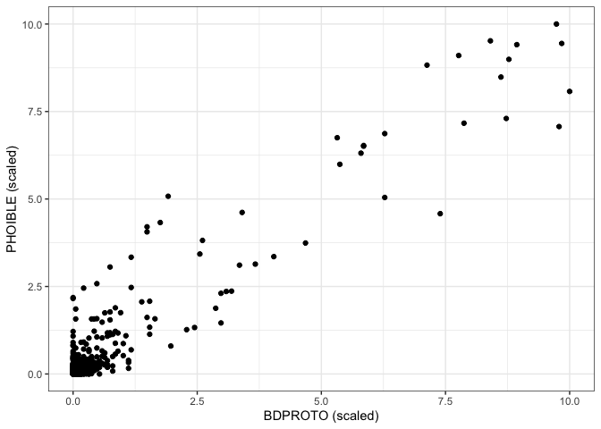<!-- -->

``` r
# Log-transformed values
scatter.log = ggplot(intersect_families_segments_long, 
                     aes(x = log(bdproto), log(phoible))) +
              geom_point() + 
              ylab("PHOIBLE (log)") +
              xlab("BDPROTO (log)") +
              theme_bw()

scatter.log
```

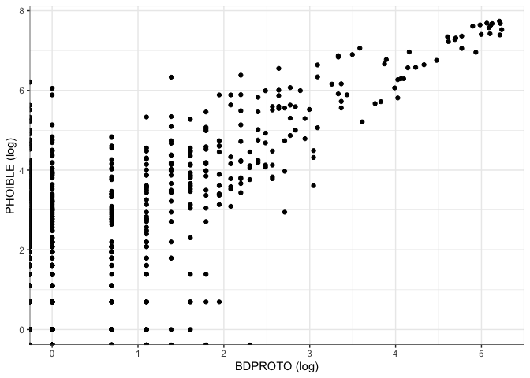<!-- -->

``` r
# Now with segments as points
# Scaled values
scatter.scaled.segpt = ggplot(intersect_families_segments_long, 
                       aes(x = scaling.func(bdproto), scaling.func(phoible), 
                          label=Phoneme)) +
                       geom_text() + 
                       ylab("PHOIBLE (scaled)") +
                       xlab("BDPROTO (scaled)") +
                       theme_bw()

scatter.scaled.segpt
```

<!-- -->

``` r
# Log-transformed values
scatter.log.segpt = ggplot(intersect_families_segments_long, 
                    aes(x = log(bdproto), log(phoible),
                        label=Phoneme)) +
                    geom_text() +
                    ylab("PHOIBLE (log)") +
                    xlab("BDPROTO (log)") +
                    theme_bw()

scatter.log.segpt
```

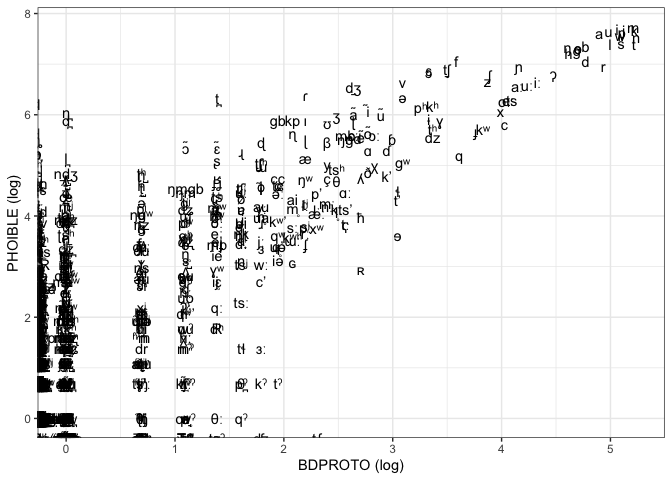<!-- -->
THese scatterplots show that the two databases agree much more in the
upper ranges. In the low-to-middle ranges, we see a great degree of
variability between the two. To anticipate what we see below, these are
precisely the areas of the frequency distribution that we find the
biggest discrepancies between the two databases regarding their
respective relationships to SegBo.

Let’s compare the segment counts of the different databases

``` r
# Overall segment counts
counts = all_dbs_all_segments %>% group_by(Database) %>%
                                  summarize(NumberOfSegments = n(), 
                                            NumberOfSegmentTypes = length(unique(Phoneme)))

counts.consonants = all_dbs_all_segments %>% 
                    filter(SegmentClass == "consonant") %>%
                    group_by(Database) %>%
                    summarize(NumberOfSegments = n(), 
                              NumberOfSegmentTypes = length(unique(Phoneme)))

counts.vowels = all_dbs_all_segments %>% 
                filter(SegmentClass == "vowel") %>%
                group_by(Database) %>%
                summarize(NumberOfSegments = n(), 
                         NumberOfSegmentTypes = length(unique(Phoneme)))

# Plot the frequencies
## All segments
### Token counts
all.token.counts = ggplot(counts, aes(x=Database, y=NumberOfSegments)) +
      geom_bar(stat="identity") +
      ylab("Number of segments") +
      ggtitle("Segment token counts") +
      theme_bw() + 
      theme(plot.title = element_text(hjust = 0.5)) 

all.token.counts
```

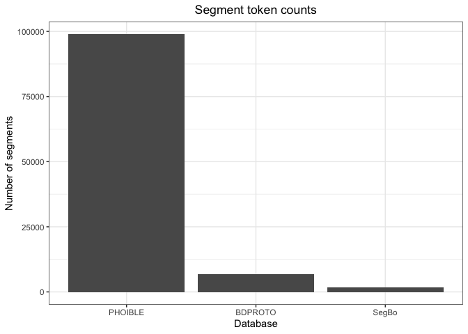<!-- -->

``` r
### Type counts
all.type.counts = ggplot(counts, aes(x=Database, y=NumberOfSegmentTypes)) +
      geom_bar(stat="identity") +
      ylab("Number of segment types") +
      ggtitle("Segment type counts") +
      theme_bw() + 
      theme(plot.title = element_text(hjust = 0.5)) 

all.type.counts
```

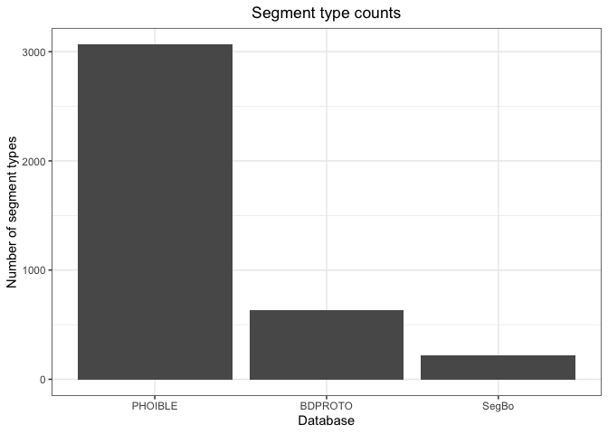<!-- -->

``` r
## Consonants only
### Token counts
con.token.counts = ggplot(counts.consonants, aes(x=Database, y=NumberOfSegments)) +
      geom_bar(stat="identity") +
      ylab("Number of segments") +
      ggtitle("Segment token counts (consonants)") +
      theme_bw() + 
      theme(plot.title = element_text(hjust = 0.5)) 

con.token.counts
```

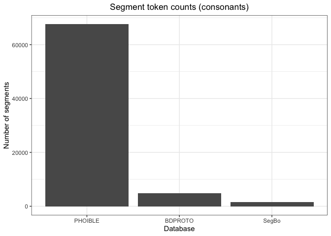<!-- -->

``` r
### Type counts
con.type.counts = ggplot(counts.consonants, aes(x=Database, y=NumberOfSegmentTypes)) +
      geom_bar(stat="identity") +
      ylab("Number of segment types") +
      ggtitle("Segment type counts (consonants)") +
      theme_bw() + 
      theme(plot.title = element_text(hjust = 0.5)) 

con.type.counts
```

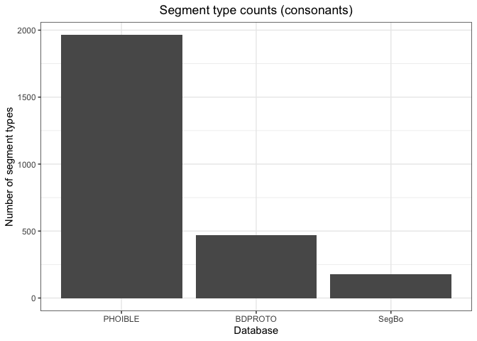<!-- -->

``` r
## Vowels only
### Token counts
vow.token.counts = ggplot(counts.vowels, aes(x=Database, y=NumberOfSegments)) +
      geom_bar(stat="identity") +
      ylab("Number of segments") +
      ggtitle("Segment token counts (vowels)") +
      theme_bw() + 
      theme(plot.title = element_text(hjust = 0.5)) 

vow.token.counts
```

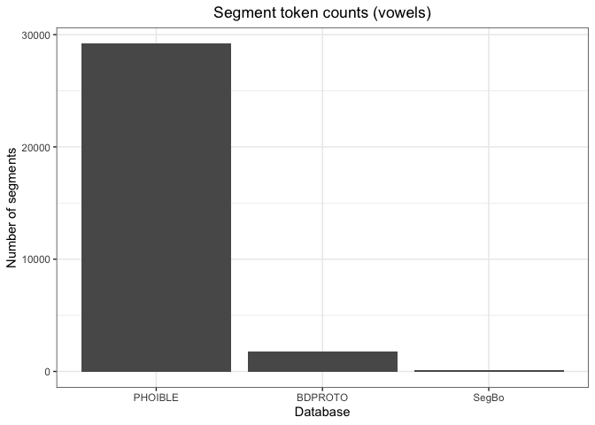<!-- -->

``` r
### Type counts
vow.type.counts = ggplot(counts.vowels, aes(x=Database, y=NumberOfSegmentTypes)) +
      geom_bar(stat="identity") +
      ylab("Number of segment types") +
      ggtitle("Segment type counts (vowels)") +
      theme_bw() + 
      theme(plot.title = element_text(hjust = 0.5)) 

vow.type.counts
```

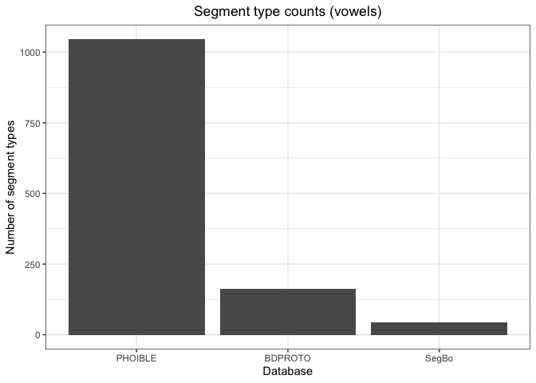<!-- -->

``` r
# ...and broken down by macroarea
counts.macro = all_dbs_all_segments %>% 
               group_by(Database, macroarea) %>%
               summarize(NumberOfSegments = n(), 
                         NumberOfSegmentTypes = length(unique(Phoneme)))

counts.macro.consonants = all_dbs_all_segments %>% 
                          filter(SegmentClass == "consonant") %>%
                          group_by(Database, macroarea) %>%
                          summarize(NumberOfSegments = n(), 
                                    NumberOfSegmentTypes = length(unique(Phoneme)))

counts.macro.vowels = all_dbs_all_segments %>% 
                      filter(SegmentClass == "vowel") %>%
                      group_by(Database, macroarea) %>%
                      summarize(NumberOfSegments = n(), 
                                NumberOfSegmentTypes = length(unique(Phoneme)))

# Proportion of each macroarea per corpus
propMacro = function(countsTotal, countsMacro){
    props = vector()
    database.counts = vector()
    for(db in countsTotal$Database){
        n = countsTotal$NumberOfSegments[countsTotal$Database==db]
        for(count in countsMacro$NumberOfSegments[countsMacro$Database==db]){
            prop = count/n
            props = c(props, prop)
            database.counts = c(database.counts, n)
        }
    }
    countsMacro$ProportionOfDatabase = props
    countsMacro$DatabaseSize = database.counts
    return(countsMacro)
}

# Total counts
counts.macro = propMacro(counts, counts.macro); 
as.data.frame(counts.macro)
```

    ##    Database     macroarea NumberOfSegments NumberOfSegmentTypes
    ## 1   PHOIBLE        Africa            35731                 1383
    ## 2   PHOIBLE     Australia             8678                  224
    ## 3   PHOIBLE       Eurasia            32959                 2064
    ## 4   PHOIBLE North America             5785                  558
    ## 5   PHOIBLE     Papunesia             5112                  383
    ## 6   PHOIBLE South America            10592                  399
    ## 7   BDPROTO        Africa              919                  203
    ## 8   BDPROTO     Australia              141                   49
    ## 9   BDPROTO       Eurasia             3124                  419
    ## 10  BDPROTO North America             1676                  231
    ## 11  BDPROTO     Papunesia              441                   78
    ## 12  BDPROTO South America              434                  121
    ## 13    SegBo        Africa              208                   80
    ## 14    SegBo     Australia               40                   22
    ## 15    SegBo       Eurasia              529                  153
    ## 16    SegBo North America              168                   49
    ## 17    SegBo     Papunesia              586                   72
    ## 18    SegBo South America              135                   36
    ##    ProportionOfDatabase DatabaseSize
    ## 1            0.36144127        98857
    ## 2            0.08778336        98857
    ## 3            0.33340077        98857
    ## 4            0.05851887        98857
    ## 5            0.05171106        98857
    ## 6            0.10714466        98857
    ## 7            0.13645137         6735
    ## 8            0.02093541         6735
    ## 9            0.46384558         6735
    ## 10           0.24884929         6735
    ## 11           0.06547884         6735
    ## 12           0.06443950         6735
    ## 13           0.12484994         1666
    ## 14           0.02400960         1666
    ## 15           0.31752701         1666
    ## 16           0.10084034         1666
    ## 17           0.35174070         1666
    ## 18           0.08103241         1666

``` r
# Consonants only
counts.macro.consonants = propMacro(counts.consonants, counts.macro.consonants); as.data.frame(counts.macro.consonants)
```

    ##    Database     macroarea NumberOfSegments NumberOfSegmentTypes
    ## 1   PHOIBLE        Africa            23813                 1010
    ## 2   PHOIBLE     Australia             6806                  180
    ## 3   PHOIBLE       Eurasia            22390                 1150
    ## 4   PHOIBLE North America             4193                  375
    ## 5   PHOIBLE     Papunesia             3568                  258
    ## 6   PHOIBLE South America             6788                  268
    ## 7   BDPROTO        Africa              739                  164
    ## 8   BDPROTO     Australia              109                   41
    ## 9   BDPROTO       Eurasia             2198                  300
    ## 10  BDPROTO North America             1217                  163
    ## 11  BDPROTO     Papunesia              364                   65
    ## 12  BDPROTO South America              285                   79
    ## 13    SegBo        Africa              198                   71
    ## 14    SegBo     Australia               22                   12
    ## 15    SegBo       Eurasia              481                  123
    ## 16    SegBo North America              155                   40
    ## 17    SegBo     Papunesia              542                   56
    ## 18    SegBo South America              115                   29
    ##    ProportionOfDatabase DatabaseSize
    ## 1            0.35248231        67558
    ## 2            0.10074307        67558
    ## 3            0.33141893        67558
    ## 4            0.06206519        67558
    ## 5            0.05281388        67558
    ## 6            0.10047663        67558
    ## 7            0.15044788         4912
    ## 8            0.02219055         4912
    ## 9            0.44747557         4912
    ## 10           0.24776059         4912
    ## 11           0.07410423         4912
    ## 12           0.05802117         4912
    ## 13           0.13086583         1513
    ## 14           0.01454065         1513
    ## 15           0.31791143         1513
    ## 16           0.10244547         1513
    ## 17           0.35822868         1513
    ## 18           0.07600793         1513

``` r
# Vowels only
counts.macro.vowels = propMacro(counts.vowels, counts.macro.vowels); 
as.data.frame(counts.macro.vowels)
```

    ##    Database     macroarea NumberOfSegments NumberOfSegmentTypes
    ## 1   PHOIBLE        Africa            10131                  339
    ## 2   PHOIBLE     Australia             1872                   44
    ## 3   PHOIBLE       Eurasia            10364                  874
    ## 4   PHOIBLE North America             1516                  164
    ## 5   PHOIBLE     Papunesia             1520                  116
    ## 6   PHOIBLE South America             3785                  122
    ## 7   BDPROTO        Africa              179                   38
    ## 8   BDPROTO     Australia               32                    8
    ## 9   BDPROTO       Eurasia              915                  115
    ## 10  BDPROTO North America              459                   68
    ## 11  BDPROTO     Papunesia               77                   13
    ## 12  BDPROTO South America              149                   42
    ## 13    SegBo        Africa               10                    9
    ## 14    SegBo     Australia               18                   10
    ## 15    SegBo       Eurasia               48                   30
    ## 16    SegBo North America               13                    9
    ## 17    SegBo     Papunesia               44                   16
    ## 18    SegBo South America               20                    7
    ##    ProportionOfDatabase DatabaseSize
    ## 1            0.34709470        29188
    ## 2            0.06413595        29188
    ## 3            0.35507743        29188
    ## 4            0.05193915        29188
    ## 5            0.05207620        29188
    ## 6            0.12967658        29188
    ## 7            0.09884042         1811
    ## 8            0.01766980         1811
    ## 9            0.50524572         1811
    ## 10           0.25345113         1811
    ## 11           0.04251795         1811
    ## 12           0.08227499         1811
    ## 13           0.06535948          153
    ## 14           0.11764706          153
    ## 15           0.31372549          153
    ## 16           0.08496732          153
    ## 17           0.28758170          153
    ## 18           0.13071895          153

``` r
# Plot the proportions of sample size per macroarea
## Total counts
p.total.cts = ggplot(counts.macro, aes(x = macroarea, y=ProportionOfDatabase, group=Database, fill=Database)) +
      geom_bar(stat="identity", position="dodge", color="black") +
      ylab("Proportion of database (%)") +
      xlab("Macroarea") +
      ggtitle("Sample size by macroarea") +
      theme_bw() + 
      theme(plot.title = element_text(hjust = 0.5)) 

p.total.cts
```

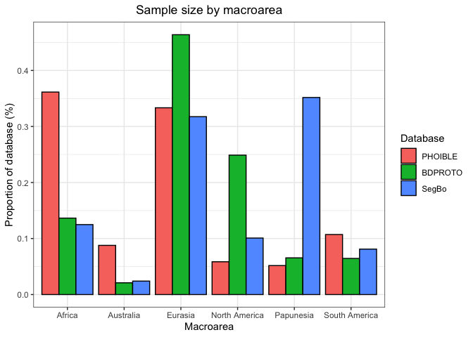<!-- -->

``` r
## Consonants only
p.consonant.cts = ggplot(counts.macro.consonants, aes(x = macroarea, y=ProportionOfDatabase, group=Database, fill=Database)) +
      geom_bar(stat="identity", position="dodge", color="black") +
      ylab("Proportion of database (%)") +
      xlab("Macroarea") +
      ggtitle("Sample size by macroarea (consonants)") +
      theme_bw() + 
      theme(plot.title = element_text(hjust = 0.5)) 

p.consonant.cts
```

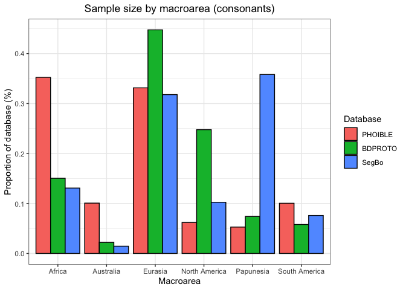<!-- -->

``` r
## Vowels only
p.vowel.cts = ggplot(counts.macro.vowels, aes(x = macroarea, y=ProportionOfDatabase, group=Database, fill=Database)) +
      geom_bar(stat="identity", position="dodge", color="black") +
      ylab("Proportion of database (%)") +
      xlab("Macroarea") +
      ggtitle("Sample size by macroarea (vowels)") +
      theme_bw() + 
      theme(plot.title = element_text(hjust = 0.5)) 

p.vowel.cts
```

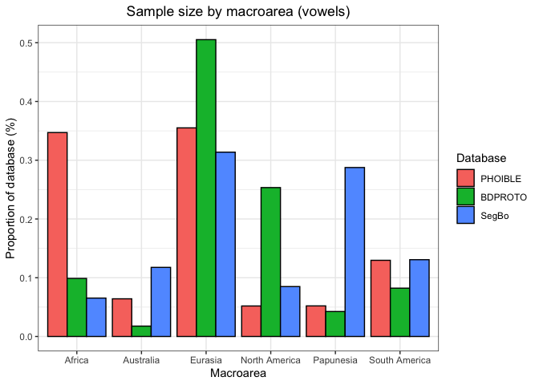<!-- -->

Clearly, PHOIBLE is much larger than the other two databases. BDPROTO is
second largest (though much smaller than PHOIBLE), and is roughly four
times as large as SegBo.

The plot of sample size by macroarea shows that each database favors one
or more macroareas more than the other two: for PHOIBLE, African and
Australian languages; for BDPROTO, North American languages (and to a
lesser extent, Eurasian languages); and for SegBo, Papunesian languages.
Furthermore, SegBo contains much richer coverage of vowels than
consonants in Australia. Finally, the overall proportions (i.e., all
segment types considered) more closely resemble the distributional
biases we see for consonants across macroareas than for vowels.

**Section 1**: Global comparisons of the databases

Create sets of two vectors based on the contrasts of interest

``` r
# Extract the vectors the we will compare

## Family-controlled frequencies
bd.pho.fam = rbind(families_segments_long[,2], families_segments_long[,3])

bd.seg.fam = rbind(intersect_families_segments_long[,3], intersect_families_segments_long[,4])

pho.seg.fam = rbind(intersect_families_segments_long[,2], intersect_families_segments_long[,4])

## Total frequencies
bd.pho.all = rbind(all_segments_long[,3], all_segments_long[,2])

pho.seg.all = rbind(all_segments_long[,2], all_segments_long[,4])

bd.seg.all = rbind(all_segments_long[,3], all_segments_long[,4])
```

Compute JSDs

``` r
## Family-controlled frequencies
jsd.bd.pho.fam = suppressMessages(JSD(bd.pho.fam, unit = "log2", est.prob="empirical"))
jsd.bd.seg.fam = suppressMessages(JSD(bd.seg.fam, unit = "log2", est.prob="empirical"))
jsd.pho.seg.fam = suppressMessages(JSD(pho.seg.fam, unit = "log2", est.prob="empirical"))
jsd.fam = c(jsd.bd.pho.fam, jsd.bd.seg.fam, jsd.pho.seg.fam)

## Total frequencies
jsd.bd.pho.all = suppressMessages(JSD(bd.pho.all, unit = "log2", est.prob="empirical"))
jsd.pho.seg.all = suppressMessages(JSD(pho.seg.all, unit = "log2", est.prob="empirical"))
jsd.bd.seg.all = suppressMessages(JSD(bd.seg.all, unit = "log2", est.prob="empirical"))
jsd.all = c(jsd.bd.pho.all, jsd.bd.seg.all, jsd.pho.seg.all)

# Plot the results
## Create a dataframe
jsd.table = data.frame(JSD = c(jsd.fam,
                               jsd.all),
                       FreqType = c(rep("Family-controlled", 3),
                                    rep("Total", 3)),
                       CompType = c(rep(c("BDPROTO-PHOIBLE",
                                          "BDPROTO-SegBo",
                                          "PHOIBLE-SegBo"), 2)))
## Cleveland's dotplot
dotchart(jsd.table$JSD,
         labels=jsd.table$CompType,
         groups=jsd.table$FreqType, 
         color=rep(c("red", "blue", "black"), 2),
         xlab="JSD",
         main="more similar ↔ less similar")
```

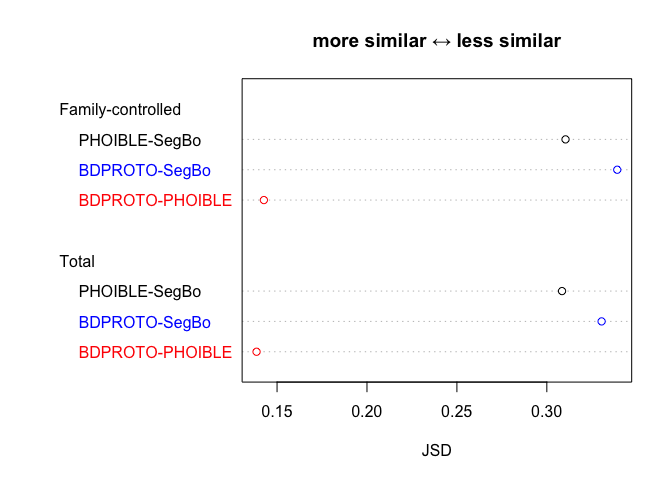<!-- -->

Recompute JSD based on a leave-one-out (LOO) sampling method.

``` r
# Regarding the plots: sounds on the left edge are responsible for distinguishing the two databases; sounds on the right edge are responsible for binding them (the sounds that make them the most similar). These can also be seen by examining the ordered dataframes.

# Function to leave out a segments, compute JSD, and record both the left-out segment and the resulting JSD
loo_jsd = function(long.df, p, q, jsd.input.type="counts"){
    jsd.list = list()
    for(i in 1:nrow(long.df)){
        current.phoneme = long.df$Phoneme[i]
        loo.df = as.data.frame(long.df %>% filter(Phoneme != current.phoneme))
        p.dist = as.vector(loo.df[,p])
        q.dist = as.vector(loo.df[,q])
        jsd.df = rbind(p.dist, q.dist)
        if(jsd.input.type == "counts"){
            current.jsd = suppressMessages(JSD(jsd.df, est.prob="empirical"))
        }
        else{
            current.jsd = suppressMessages(JSD(jsd.df))
        }
        current.row = data.frame(Dropped_Phoneme = current.phoneme, JSD = current.jsd, SourceDB = p, TargetDB = q)
        jsd.list[[i]] = current.row
    }
    jsd.tab = do.call(rbind, jsd.list)
    jsd.tab = jsd.tab[with(jsd.tab, order(JSD)),]

    # Produce a plot of the segments by how much their absence
    # contributes to the change in JSD
    segPlot = ggplot(jsd.tab, aes(x = seq(1:nrow(jsd.tab)), y = JSD, label = Dropped_Phoneme)) +
    geom_text() +
    ggtitle(paste0("Leave-one-out JSDs: ", p, " → ", q)) +
    xlab("Rank") +
    theme_bw() +
    theme(plot.title = element_text(hjust = 0.5))

    return(list(jsd.tab, segPlot))
}

# Family-controlled frequencies
## BDPROTO vs. PHOIBLE
loo.bd.pho.fam = loo_jsd(families_segments_long, "bdproto", "phoible")

head(loo.bd.pho.fam[[1]], 20)
```

    ##                    Dropped_Phoneme       JSD SourceDB TargetDB
    ## jensen-shannon39                 ˦ 0.1400921  bdproto  phoible
    ## jensen-shannon40                 ˨ 0.1401229  bdproto  phoible
    ## jensen-shannon45                 n̪ 0.1409128  bdproto  phoible
    ## jensen-shannon35                 t̪ 0.1410194  bdproto  phoible
    ## jensen-shannon55                 d̪ 0.1412381  bdproto  phoible
    ## jensen-shannon63                 ˧ 0.1412563  bdproto  phoible
    ## jensen-shannon70            \u0235 0.1413689  bdproto  phoible
    ## jensen-shannon76            \u0236 0.1415941  bdproto  phoible
    ## jensen-shannon83                 e̞ 0.1416759  bdproto  phoible
    ## jensen-shannon237                ɘ 0.1419027  bdproto  phoible
    ## jensen-shannon94                t̪ʰ 0.1419110  bdproto  phoible
    ## jensen-shannon33                 ɾ 0.1419697  bdproto  phoible
    ## jensen-shannon97                ˦˨ 0.1419877  bdproto  phoible
    ## jensen-shannon81                 o̞ 0.1419997  bdproto  phoible
    ## jensen-shannon101           \u0234 0.1420387  bdproto  phoible
    ## jensen-shannon2722              t̠ʆ 0.1420445  bdproto  phoible
    ## jensen-shannon32                d̠ʒ 0.1420498  bdproto  phoible
    ## jensen-shannon106               ˨˦ 0.1420898  bdproto  phoible
    ## jensen-shannon110              n̪|n 0.1421000  bdproto  phoible
    ## jensen-shannon332                ʀ 0.1421141  bdproto  phoible

``` r
tail(loo.bd.pho.fam[[1]], 20)
```

    ##                  Dropped_Phoneme       JSD SourceDB TargetDB
    ## jensen-shannon21               ɲ 0.1442538  bdproto  phoible
    ## jensen-shannon18               d 0.1447722  bdproto  phoible
    ## jensen-shannon13               ŋ 0.1451231  bdproto  phoible
    ## jensen-shannon17               h 0.1451530  bdproto  phoible
    ## jensen-shannon16               ɡ 0.1451772  bdproto  phoible
    ## jensen-shannon15               e 0.1453474  bdproto  phoible
    ## jensen-shannon14               o 0.1453485  bdproto  phoible
    ## jensen-shannon11               t 0.1454353  bdproto  phoible
    ## jensen-shannon12               b 0.1454453  bdproto  phoible
    ## jensen-shannon10               l 0.1457333  bdproto  phoible
    ## jensen-shannon9                s 0.1457506  bdproto  phoible
    ## jensen-shannon8                n 0.1460501  bdproto  phoible
    ## jensen-shannon6                a 0.1461279  bdproto  phoible
    ## jensen-shannon7                w 0.1463041  bdproto  phoible
    ## jensen-shannon4                u 0.1463355  bdproto  phoible
    ## jensen-shannon5                p 0.1464908  bdproto  phoible
    ## jensen-shannon1                i 0.1465824  bdproto  phoible
    ## jensen-shannon3                j 0.1466343  bdproto  phoible
    ## jensen-shannon2                k 0.1467316  bdproto  phoible
    ## jensen-shannon                 m 0.1469177  bdproto  phoible

``` r
p.loo.bd.pho.fam = loo.bd.pho.fam[[2]]; p.loo.bd.pho.fam
```

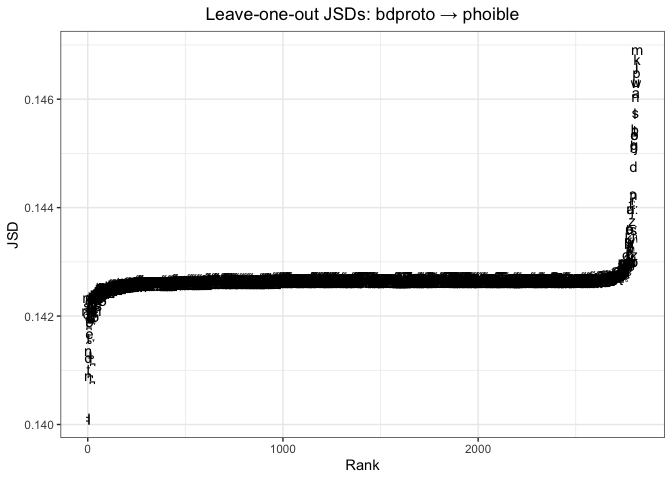<!-- -->

``` r
## BDPROTO vs. SegBo
loo.bd.seg.fam = loo_jsd(intersect_families_segments_long, "bdproto", "segbo")

head(loo.bd.seg.fam[[1]], 20)
```

    ##                   Dropped_Phoneme       JSD SourceDB TargetDB
    ## jensen-shannon18                f 0.3226981  bdproto    segbo
    ## jensen-shannon32               d̠ʒ 0.3298285  bdproto    segbo
    ## jensen-shannon1                 i 0.3298766  bdproto    segbo
    ## jensen-shannon                  m 0.3320007  bdproto    segbo
    ## jensen-shannon8                 n 0.3329772  bdproto    segbo
    ## jensen-shannon6                 a 0.3332991  bdproto    segbo
    ## jensen-shannon4                 u 0.3339994  bdproto    segbo
    ## jensen-shannon22               t̠ʃ 0.3354663  bdproto    segbo
    ## jensen-shannon29                v 0.3355820  bdproto    segbo
    ## jensen-shannon59               kʷ 0.3364921  bdproto    segbo
    ## jensen-shannon33                ɾ 0.3368509  bdproto    segbo
    ## jensen-shannon48                ʒ 0.3368796  bdproto    segbo
    ## jensen-shannon28               iː 0.3375237  bdproto    segbo
    ## jensen-shannon30               uː 0.3378445  bdproto    segbo
    ## jensen-shannon143              tʼ 0.3379457  bdproto    segbo
    ## jensen-shannon565              ɕː 0.3380910  bdproto    segbo
    ## jensen-shannon47                ũ 0.3381196  bdproto    segbo
    ## jensen-shannon62                õ 0.3382354  bdproto    segbo
    ## jensen-shannon68                ẽ 0.3382933  bdproto    segbo
    ## jensen-shannon331               ʀ 0.3382933  bdproto    segbo

``` r
tail(loo.bd.seg.fam[[1]], 20)
```

    ##                  Dropped_Phoneme       JSD SourceDB TargetDB
    ## jensen-shannon84               q 0.3415366  bdproto    segbo
    ## jensen-shannon25               ʃ 0.3415885  bdproto    segbo
    ## jensen-shannon2                k 0.3422724  bdproto    segbo
    ## jensen-shannon7                w 0.3427481  bdproto    segbo
    ## jensen-shannon44               x 0.3428431  bdproto    segbo
    ## jensen-shannon20               ɲ 0.3429658  bdproto    segbo
    ## jensen-shannon36              ts 0.3431183  bdproto    segbo
    ## jensen-shannon3                j 0.3438133  bdproto    segbo
    ## jensen-shannon26               ʔ 0.3438182  bdproto    segbo
    ## jensen-shannon13               ŋ 0.3441855  bdproto    segbo
    ## jensen-shannon14               e 0.3448758  bdproto    segbo
    ## jensen-shannon15               o 0.3456108  bdproto    segbo
    ## jensen-shannon17               h 0.3457997  bdproto    segbo
    ## jensen-shannon16               ɡ 0.3460076  bdproto    segbo
    ## jensen-shannon9                s 0.3462315  bdproto    segbo
    ## jensen-shannon19               d 0.3471859  bdproto    segbo
    ## jensen-shannon12               b 0.3473084  bdproto    segbo
    ## jensen-shannon10               l 0.3473926  bdproto    segbo
    ## jensen-shannon5                p 0.3482239  bdproto    segbo
    ## jensen-shannon21               r 0.3484396  bdproto    segbo

``` r
p.loo.bd.seg.fam = loo.bd.seg.fam[[2]]; p.loo.bd.seg.fam
```

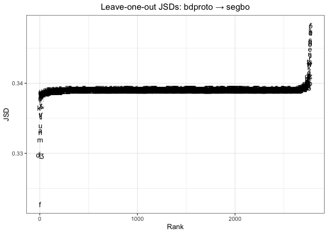<!-- -->

``` r
## PHOIBLE vs. SegBo
loo.pho.seg.fam = loo_jsd(intersect_families_segments_long, "phoible", "segbo")

head(loo.pho.seg.fam[[1]], 20)
```

    ##                   Dropped_Phoneme       JSD SourceDB TargetDB
    ## jensen-shannon1                 i 0.3007100  phoible    segbo
    ## jensen-shannon6                 a 0.3034467  phoible    segbo
    ## jensen-shannon                  m 0.3037111  phoible    segbo
    ## jensen-shannon18                f 0.3041593  phoible    segbo
    ## jensen-shannon4                 u 0.3045521  phoible    segbo
    ## jensen-shannon8                 n 0.3065751  phoible    segbo
    ## jensen-shannon39                ˦ 0.3082041  phoible    segbo
    ## jensen-shannon40                ˨ 0.3082305  phoible    segbo
    ## jensen-shannon47                ũ 0.3086393  phoible    segbo
    ## jensen-shannon52               ɡb 0.3088193  phoible    segbo
    ## jensen-shannon215               ʕ 0.3088211  phoible    segbo
    ## jensen-shannon32               d̠ʒ 0.3088433  phoible    segbo
    ## jensen-shannon59               kʷ 0.3090650  phoible    segbo
    ## jensen-shannon62                õ 0.3091746  phoible    segbo
    ## jensen-shannon63                ˧ 0.3091790  phoible    segbo
    ## jensen-shannon991              ðˤ 0.3091868  phoible    segbo
    ## jensen-shannon64               ɛː 0.3092141  phoible    segbo
    ## jensen-shannon68                ẽ 0.3092623  phoible    segbo
    ## jensen-shannon71           \u0235 0.3093105  phoible    segbo
    ## jensen-shannon28               iː 0.3094929  phoible    segbo

``` r
tail(loo.pho.seg.fam[[1]], 20)
```

    ##                  Dropped_Phoneme       JSD SourceDB TargetDB
    ## jensen-shannon23               ɛ 0.3126784  phoible    segbo
    ## jensen-shannon36              ts 0.3127144  phoible    segbo
    ## jensen-shannon33               ɾ 0.3127845  phoible    segbo
    ## jensen-shannon2                k 0.3134588  phoible    segbo
    ## jensen-shannon7                w 0.3137425  phoible    segbo
    ## jensen-shannon25               ʃ 0.3138488  phoible    segbo
    ## jensen-shannon26               ʔ 0.3139517  phoible    segbo
    ## jensen-shannon20               ɲ 0.3141190  phoible    segbo
    ## jensen-shannon3                j 0.3145356  phoible    segbo
    ## jensen-shannon21               r 0.3145478  phoible    segbo
    ## jensen-shannon13               ŋ 0.3150161  phoible    segbo
    ## jensen-shannon19               d 0.3153680  phoible    segbo
    ## jensen-shannon14               e 0.3155282  phoible    segbo
    ## jensen-shannon16               ɡ 0.3158746  phoible    segbo
    ## jensen-shannon17               h 0.3160639  phoible    segbo
    ## jensen-shannon15               o 0.3161868  phoible    segbo
    ## jensen-shannon9                s 0.3163432  phoible    segbo
    ## jensen-shannon10               l 0.3170915  phoible    segbo
    ## jensen-shannon12               b 0.3173897  phoible    segbo
    ## jensen-shannon5                p 0.3182575  phoible    segbo

``` r
p.loo.pho.seg.fam = loo.pho.seg.fam[[2]]; p.loo.pho.seg.fam
```

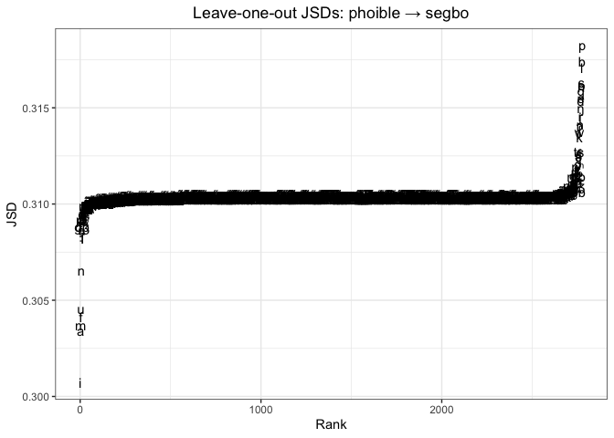<!-- -->

``` r
# Total frequencies
## BDPROTO vs. PHOIBLE
loo.bd.pho.all = loo_jsd(all_segments_long, "bdproto", "phoible")

head(loo.bd.pho.all[[1]], 20)
```

    ##                   Dropped_Phoneme       JSD SourceDB TargetDB
    ## jensen-shannon42                ˦ 0.1362883  bdproto  phoible
    ## jensen-shannon43                ˨ 0.1363177  bdproto  phoible
    ## jensen-shannon45                n̪ 0.1367840  bdproto  phoible
    ## jensen-shannon58           \u0235 0.1370110  bdproto  phoible
    ## jensen-shannon34                t̪ 0.1370318  bdproto  phoible
    ## jensen-shannon67           \u0236 0.1372921  bdproto  phoible
    ## jensen-shannon73                ˧ 0.1373467  bdproto  phoible
    ## jensen-shannon76                e̞ 0.1374263  bdproto  phoible
    ## jensen-shannon53                d̪ 0.1374269  bdproto  phoible
    ## jensen-shannon75                o̞ 0.1377426  bdproto  phoible
    ## jensen-shannon90           \u0234 0.1377573  bdproto  phoible
    ## jensen-shannon258               ɘ 0.1378675  bdproto  phoible
    ## jensen-shannon33                ɾ 0.1379147  bdproto  phoible
    ## jensen-shannon100             n̪|n 0.1379290  bdproto  phoible
    ## jensen-shannon106             t̪|t 0.1379625  bdproto  phoible
    ## jensen-shannon31               d̠ʒ 0.1379983  bdproto  phoible
    ## jensen-shannon110              ˦˨ 0.1380044  bdproto  phoible
    ## jensen-shannon375               ʀ 0.1380262  bdproto  phoible
    ## jensen-shannon114             l̪|l 0.1380295  bdproto  phoible
    ## jensen-shannon115             s̪|s 0.1380337  bdproto  phoible

``` r
tail(loo.bd.pho.all[[1]], 20)
```

    ##                  Dropped_Phoneme       JSD SourceDB TargetDB
    ## jensen-shannon23               ʔ 0.1401725  bdproto  phoible
    ## jensen-shannon18               d 0.1404940  bdproto  phoible
    ## jensen-shannon13               ŋ 0.1409317  bdproto  phoible
    ## jensen-shannon16               ɡ 0.1409344  bdproto  phoible
    ## jensen-shannon17               h 0.1409839  bdproto  phoible
    ## jensen-shannon15               o 0.1411822  bdproto  phoible
    ## jensen-shannon14               e 0.1412031  bdproto  phoible
    ## jensen-shannon12               b 0.1412280  bdproto  phoible
    ## jensen-shannon9                t 0.1413010  bdproto  phoible
    ## jensen-shannon11               s 0.1414185  bdproto  phoible
    ## jensen-shannon10               l 0.1415373  bdproto  phoible
    ## jensen-shannon8                n 0.1419166  bdproto  phoible
    ## jensen-shannon5                a 0.1420447  bdproto  phoible
    ## jensen-shannon7                w 0.1421540  bdproto  phoible
    ## jensen-shannon4                u 0.1422156  bdproto  phoible
    ## jensen-shannon6                p 0.1423147  bdproto  phoible
    ## jensen-shannon3                j 0.1424305  bdproto  phoible
    ## jensen-shannon1                i 0.1424517  bdproto  phoible
    ## jensen-shannon2                k 0.1425474  bdproto  phoible
    ## jensen-shannon                 m 0.1427415  bdproto  phoible

``` r
p.loo.bd.pho.all = loo.bd.pho.all[[2]]; p.loo.bd.pho.all
```

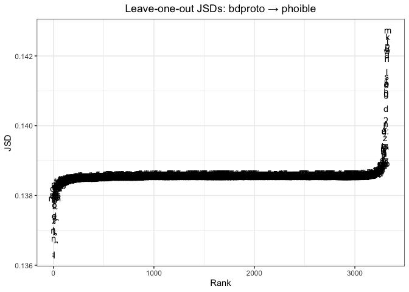<!-- -->

``` r
## BDPROTO vs. SegBo
loo.bd.seg.all = loo_jsd(all_segments_long, "bdproto", "segbo")

head(loo.bd.seg.all[[1]], 20)
```

    ##                   Dropped_Phoneme       JSD SourceDB TargetDB
    ## jensen-shannon20                f 0.3136772  bdproto    segbo
    ## jensen-shannon1                 i 0.3206693  bdproto    segbo
    ## jensen-shannon31               d̠ʒ 0.3211037  bdproto    segbo
    ## jensen-shannon5                 a 0.3238524  bdproto    segbo
    ## jensen-shannon                  m 0.3240125  bdproto    segbo
    ## jensen-shannon4                 u 0.3245575  bdproto    segbo
    ## jensen-shannon8                 n 0.3247607  bdproto    segbo
    ## jensen-shannon32                v 0.3266556  bdproto    segbo
    ## jensen-shannon50                ʒ 0.3277770  bdproto    segbo
    ## jensen-shannon22               t̠ʃ 0.3280050  bdproto    segbo
    ## jensen-shannon33                ɾ 0.3284084  bdproto    segbo
    ## jensen-shannon27               iː 0.3285027  bdproto    segbo
    ## jensen-shannon9                 t 0.3287684  bdproto    segbo
    ## jensen-shannon102              tʼ 0.3288207  bdproto    segbo
    ## jensen-shannon30               uː 0.3288288  bdproto    segbo
    ## jensen-shannon61               kʷ 0.3291779  bdproto    segbo
    ## jensen-shannon656              ɕː 0.3294908  bdproto    segbo
    ## jensen-shannon47                ũ 0.3295673  bdproto    segbo
    ## jensen-shannon119             tsʼ 0.3296666  bdproto    segbo
    ## jensen-shannon375               ʀ 0.3296666  bdproto    segbo

``` r
tail(loo.bd.seg.all[[1]], 20)
```

    ##                  Dropped_Phoneme       JSD SourceDB TargetDB
    ## jensen-shannon80               q 0.3326294  bdproto    segbo
    ## jensen-shannon25               ʃ 0.3328576  bdproto    segbo
    ## jensen-shannon2                k 0.3337501  bdproto    segbo
    ## jensen-shannon7                w 0.3338982  bdproto    segbo
    ## jensen-shannon21               ɲ 0.3340161  bdproto    segbo
    ## jensen-shannon41               x 0.3341504  bdproto    segbo
    ## jensen-shannon3                j 0.3341640  bdproto    segbo
    ## jensen-shannon36              ts 0.3342911  bdproto    segbo
    ## jensen-shannon13               ŋ 0.3352203  bdproto    segbo
    ## jensen-shannon23               ʔ 0.3354354  bdproto    segbo
    ## jensen-shannon16               ɡ 0.3356751  bdproto    segbo
    ## jensen-shannon14               e 0.3360063  bdproto    segbo
    ## jensen-shannon15               o 0.3368857  bdproto    segbo
    ## jensen-shannon17               h 0.3373615  bdproto    segbo
    ## jensen-shannon12               b 0.3379874  bdproto    segbo
    ## jensen-shannon11               s 0.3380972  bdproto    segbo
    ## jensen-shannon18               d 0.3381131  bdproto    segbo
    ## jensen-shannon10               l 0.3390740  bdproto    segbo
    ## jensen-shannon19               r 0.3392909  bdproto    segbo
    ## jensen-shannon6                p 0.3402177  bdproto    segbo

``` r
p.loo.bd.seg.all = loo.bd.seg.all[[2]]; p.loo.bd.seg.all
```

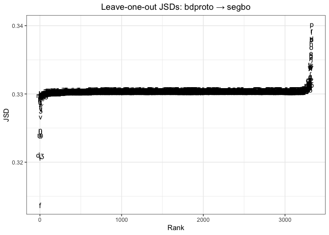<!-- -->

``` r
## PHOIBLE vs. SegBo
loo.pho.seg.all = loo_jsd(all_segments_long, "phoible", "segbo")

head(loo.pho.seg.all[[1]], 20)
```

    ##                    Dropped_Phoneme       JSD SourceDB TargetDB
    ## jensen-shannon1                  i 0.2985887  phoible    segbo
    ## jensen-shannon5                  a 0.3010958  phoible    segbo
    ## jensen-shannon20                 f 0.3014884  phoible    segbo
    ## jensen-shannon4                  u 0.3022164  phoible    segbo
    ## jensen-shannon                   m 0.3024338  phoible    segbo
    ## jensen-shannon8                  n 0.3050747  phoible    segbo
    ## jensen-shannon42                 ˦ 0.3065248  phoible    segbo
    ## jensen-shannon43                 ˨ 0.3065494  phoible    segbo
    ## jensen-shannon31                d̠ʒ 0.3067269  phoible    segbo
    ## jensen-shannon47                 ũ 0.3067285  phoible    segbo
    ## jensen-shannon214                ʕ 0.3067936  phoible    segbo
    ## jensen-shannon58            \u0235 0.3071282  phoible    segbo
    ## jensen-shannon66                 ẽ 0.3073279  phoible    segbo
    ## jensen-shannon67            \u0236 0.3073629  phoible    segbo
    ## jensen-shannon1156              ðˤ 0.3073662  phoible    segbo
    ## jensen-shannon27                iː 0.3073786  phoible    segbo
    ## jensen-shannon71                 ɻ 0.3073874  phoible    segbo
    ## jensen-shannon73                 ˧ 0.3074084  phoible    segbo
    ## jensen-shannon76                 e̞ 0.3074749  phoible    segbo
    ## jensen-shannon30                uː 0.3075716  phoible    segbo

``` r
tail(loo.pho.seg.all[[1]], 20)
```

    ##                  Dropped_Phoneme       JSD SourceDB TargetDB
    ## jensen-shannon24               ɛ 0.3106974  phoible    segbo
    ## jensen-shannon36              ts 0.3107605  phoible    segbo
    ## jensen-shannon33               ɾ 0.3109454  phoible    segbo
    ## jensen-shannon7                w 0.3117542  phoible    segbo
    ## jensen-shannon2                k 0.3118303  phoible    segbo
    ## jensen-shannon3                j 0.3118448  phoible    segbo
    ## jensen-shannon25               ʃ 0.3118454  phoible    segbo
    ## jensen-shannon21               ɲ 0.3120780  phoible    segbo
    ## jensen-shannon23               ʔ 0.3122644  phoible    segbo
    ## jensen-shannon19               r 0.3127420  phoible    segbo
    ## jensen-shannon16               ɡ 0.3128429  phoible    segbo
    ## jensen-shannon18               d 0.3128710  phoible    segbo
    ## jensen-shannon13               ŋ 0.3129615  phoible    segbo
    ## jensen-shannon14               e 0.3134211  phoible    segbo
    ## jensen-shannon17               h 0.3140727  phoible    segbo
    ## jensen-shannon15               o 0.3141099  phoible    segbo
    ## jensen-shannon11               s 0.3146948  phoible    segbo
    ## jensen-shannon12               b 0.3150442  phoible    segbo
    ## jensen-shannon10               l 0.3153893  phoible    segbo
    ## jensen-shannon6                p 0.3168905  phoible    segbo

``` r
p.loo.pho.seg.all = loo.pho.seg.all[[2]]; p.loo.pho.seg.all
```

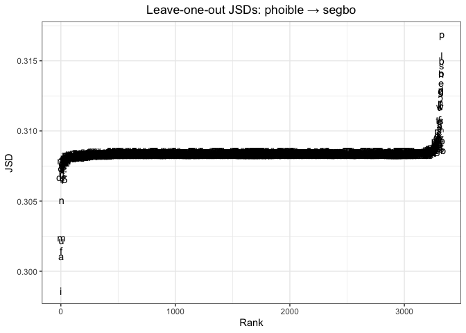<!-- -->

Note that the variability falls in a very narrow range, indicating that
(a) there is a high degree of similarity between the frequency
distributions in the PHOIBLE and BDPROTO databases, and (b) only a
relatively small number of segments play any role in distinguishing the
databases.

Now let’s model differences between PHOIBLE and BDPROTO as they relate
to SegBo frequencies.

``` r
freq.mod = function(df, plot.title, db.specific = F){
    mod.dat = df
      
    # Scale the variables (sample sizes and scales are different; 
    # this makes the numbers comparable)
    mod.dat$phoible.scaled = scaling.func(mod.dat$phoible)
    mod.dat$bdproto.scaled = scaling.func(mod.dat$bdproto)

    # Turn into long format
    mod.dat.long = data.frame(Phoneme = rep(mod.dat$Phoneme, 2),
                              Frequency.scaled = c(mod.dat$phoible.scaled,
                                                   mod.dat$bdproto.scaled),
                              Frequency.source = c(rep("phoible", 
                                                       length(mod.dat$phoible.scaled)), 
                                                   rep("bdproto",
                                                       length(mod.dat$bdproto.scaled))))
    # Add the SegBo frequencies
    mod.dat.long = left_join(mod.dat.long, 
                             df[, c("Phoneme", "segbo")],
                             by="Phoneme")
    
    # In case we want one database modeled at a time.
    if(db.specific){
        mod.dat.long.pho = mod.dat.long %>% filter(Frequency.source == "phoible")
        mod.dat.long.bd = mod.dat.long %>% filter(Frequency.source == "bdproto")

        mod.pho = glm(segbo ~ poly(Frequency.scaled,6), data = mod.dat.long.pho, family="quasipoisson" )
        
        mod.bd = glm(segbo ~ poly(Frequency.scaled,7), data = mod.dat.long.bd, family="quasipoisson" )

        # Plotting results
        hyp.data = data.frame(Frequency.scaled = seq(0, 10))

        # Get predicted values
        preds.hyp.pho = predict(mod.pho, newdata=hyp.data, type="response", se.fit=T)
        
        preds.hyp.bd = predict(mod.bd, newdata=hyp.data, type="response", se.fit=T)

        # Compute upper and lower standard errors
        hyp.data = data.frame(Frequency.scaled = rep(seq(0, 10), 2),
                         SegBo = c(preds.hyp.pho$fit, preds.hyp.bd$fit),
                         upper = c(preds.hyp.pho$fit + preds.hyp.pho$se.fit, 
                                   preds.hyp.bd$fit + preds.hyp.bd$se.fit),
                         lower = c(preds.hyp.pho$fit - preds.hyp.pho$se.fit,
                                 preds.hyp.bd$fit - preds.hyp.bd$se.fit),
                         Frequency.source = c(rep("PHOIBLE", length(preds.hyp.pho$fit)),
                                              rep("BDPROTO", length(preds.hyp.bd$fit))))

        # Plotting
        p = ggplot(hyp.data, aes(y=SegBo, x=Frequency.scaled, group=Frequency.source,  fill=Frequency.source)) + 
              geom_line() + 
              geom_ribbon(aes(ymin=lower,ymax=upper), alpha=0.7) +
              xlab("Inventory frequency (scaled)") +
              ylab("Predicted SegBo frequency") +
              ggtitle(plot.title) +
              scale_fill_manual(values=c("lightblue", "darkred"),
                                name="Database") +
              theme_bw() +
              theme(plot.title = element_text(hjust=0.5))
    }
    
    else{
        # Modeling (7th order polynomial decided on basis of initial exploratory GAM)
        mod = glm(segbo ~ poly(Frequency.scaled,7)*Frequency.source, data = mod.dat.long, family="quasipoisson" )

        # Plotting results
        hyp.data = expand.grid(Frequency.scaled = seq(0, 10), 
                           Frequency.source = c("phoible", "bdproto"))

        # Get predicted values
        preds.hyp = predict(mod, newdata=hyp.data, type="response", se.fit=T)

        # Compute upper and lower standard errors
        hyp.data = cbind(hyp.data,
                     SegBo = preds.hyp$fit, 
                     upper = preds.hyp$fit + preds.hyp$se.fit, 
                     lower = preds.hyp$fit - preds.hyp$se.fit)

        # Fix factor levels
        hyp.data$Frequency.source = toupper(hyp.data$Frequency.source)

        # Plotting
        p = ggplot(hyp.data, aes(y=SegBo, x=Frequency.scaled, group=Frequency.source,  fill=Frequency.source)) + 
              geom_line() + 
              geom_ribbon(aes(ymin=lower,ymax=upper), alpha=0.7) +
              xlab("Inventory frequency (scaled)") +
              ylab("Predicted SegBo frequency") +
              ggtitle(plot.title) +
              scale_fill_manual(values=c("lightblue", "darkred"),
                                name="Database") +
              theme_bw() +
              theme(plot.title = element_text(hjust=0.5))
    
    }

    return(list(mod, p, mod.dat.long))
}

# Comparing BDPROTO to PHOIBLE, all segments
bd.pho.contrast.allsegs = freq.mod(intersect_families_segments_long, "BDPROTO vs. PHOIBLE")
anova(bd.pho.contrast.allsegs[[1]], test="Chisq")
```

    ## Analysis of Deviance Table
    ## 
    ## Model: quasipoisson, link: log
    ## 
    ## Response: segbo
    ## 
    ## Terms added sequentially (first to last)
    ## 
    ## 
    ##                                            Df Deviance Resid. Df
    ## NULL                                                        5553
    ## poly(Frequency.scaled, 7)                   7  17014.9      5546
    ## Frequency.source                            1     32.5      5545
    ## poly(Frequency.scaled, 7):Frequency.source  7    355.1      5538
    ##                                            Resid. Dev  Pr(>Chi)    
    ## NULL                                          22205.8              
    ## poly(Frequency.scaled, 7)                      5190.9 < 2.2e-16 ***
    ## Frequency.source                               5158.4 0.0002666 ***
    ## poly(Frequency.scaled, 7):Frequency.source     4803.4 < 2.2e-16 ***
    ## ---
    ## Signif. codes:  0 '***' 0.001 '**' 0.01 '*' 0.05 '.' 0.1 ' ' 1

``` r
poisson.all = bd.pho.contrast.allsegs[[2]]; poisson.all
```

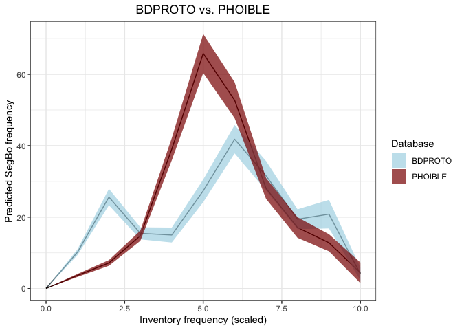<!-- -->
We can also simply model SegBo frequency by each database separately and
overlay the results. This avoids a potential issue with the reported
analysis, in which single observations (i.e., the SegBo frequency for a
given phoneme) is repeated twice (once for each database). Under this
formulation, we cannot directly estimate any difference due to the
database (i.e., PHOIBLE vs. BDPROTO). Nevertheless, if the prior results
are replicated, then we stand on firmer ground when interpreting them.

``` r
# PHOIBLE only
bd.pho.contrast.allsegs.singModels = freq.mod(intersect_families_segments_long, "BDPROTO vs. PHOIBLE", T)

anova(bd.pho.contrast.allsegs[[1]], test="Chisq")
```

    ## Analysis of Deviance Table
    ## 
    ## Model: quasipoisson, link: log
    ## 
    ## Response: segbo
    ## 
    ## Terms added sequentially (first to last)
    ## 
    ## 
    ##                                            Df Deviance Resid. Df
    ## NULL                                                        5553
    ## poly(Frequency.scaled, 7)                   7  17014.9      5546
    ## Frequency.source                            1     32.5      5545
    ## poly(Frequency.scaled, 7):Frequency.source  7    355.1      5538
    ##                                            Resid. Dev  Pr(>Chi)    
    ## NULL                                          22205.8              
    ## poly(Frequency.scaled, 7)                      5190.9 < 2.2e-16 ***
    ## Frequency.source                               5158.4 0.0002666 ***
    ## poly(Frequency.scaled, 7):Frequency.source     4803.4 < 2.2e-16 ***
    ## ---
    ## Signif. codes:  0 '***' 0.001 '**' 0.01 '*' 0.05 '.' 0.1 ' ' 1

``` r
poisson.all.singModels = bd.pho.contrast.allsegs.singModels[[2]]; poisson.all.singModels
```

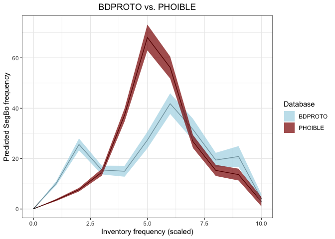<!-- -->
The results are nearly identical, so we continue with the
interaction-based models.

One of our reviewers points out that the relationship between
frequencies may differ across geographic areas. We therefore expand the
modeling dataset by adding frequencies per macroarea per database. We
explore several model structures. First, we leave the model structure
from the full model intact, but split the data up by macroarea. We then
run two generalized linear mixed-effect Poisson regressions with
macroarea and family as random effects (crosed and nested,
respectively).

``` r
# Split the column which contains information about inventory ID and database into separate columns
all.dat = all_dbs_all_segments %>% 
          separate(InventoryID, c("InventoryID", "Database"), "_")

# Find the families that are shared between each database
shared.fams = intersect(all.dat$family_id_simplified[all.dat$Database=="phoible"],
                        all.dat$family_id_simplified[all.dat$Database=="bdproto"])

shared.fams = intersect(shared.fams,
                        all.dat$family_id_simplified[all.dat$Database=="segbo"])

# Find the segments that are shared between the three databases
common.segs = intersect(all.dat$Phoneme[all.dat$Database=="phoible"],
                        all.dat$Phoneme[all.dat$Database=="bdproto"])

common.segs = intersect(common.segs,
                        all.dat$Phoneme[all.dat$Database=="segbo"])

#######################
# Computing frequencies
#######################
# Function to extract SegBo frequencies from overall tables
segbo.freqs = all.dat %>%
              filter(Database == "segbo") %>%
              group_by(Phoneme) %>%
              summarize(SegBo = n()) %>%
              mutate(SegBo.scaled = scaling.func(SegBo)) %>%
              as.data.frame()

segbo.freqs.area = all.dat %>%
                   filter(Database == "segbo") %>%
                   group_by(macroarea, Phoneme) %>%
                   summarize(SegBo = n()) %>%
                   mutate(SegBo.scaled = scaling.func(SegBo)) %>%
                   as.data.frame()

# Create a dataset in which frequencies are derived by 
# splitting into macroareas and families
######################################################
mod.dat.area.family.intersect = all.dat %>% 
                                filter(family_id_simplified %in% shared.fams) %>%
                                group_by(Database, macroarea, 
                                         family_id_simplified, Phoneme) %>%
                                summarize(frequency = n()) %>%
                                group_by(Database, macroarea) %>%
                                mutate(scaled.frequency = scaling.func(frequency))

#### ... and add them as a new column
mod.dat.area.family.intersect = mod.dat.area.family.intersect %>%
                                filter(Database != "segbo") %>%
                                left_join(., segbo.freqs,
                                          by = "Phoneme") %>%
                                tidyr::replace_na(., list(SegBo=0, SegBo.scaled=0)) %>%
                                as.data.frame() %>%
                                droplevels()

# Now compute frequencies by splitting the data only by macroarea
#################################################################
mod.dat.area =  all.dat %>% 
                filter(family_id_simplified %in% shared.fams) %>%
                group_by(Database, macroarea, Phoneme) %>%                                                 summarize(frequency = n()) %>%
                group_by(Database, macroarea) %>%
                mutate(scaled.frequency = scaling.func(frequency))

#### ... and add them as a new column
mod.dat.area.intersect = mod.dat.area %>%
                         filter(Database != "segbo") %>%
                         left_join(., segbo.freqs,
                                   by = "Phoneme") %>%
                         replace_na(., list(SegBo=0, SegBo.scaled=0)) %>%
                         as.data.frame() %>%
                         droplevels()

#### ... and add area-specific SegBo counts
mod.dat.area.intersect.macro = mod.dat.area %>%
                               filter(Database != "segbo") %>%
                               left_join(., segbo.freqs.area,
                                         by = c("macroarea", "Phoneme")) %>%
                               replace_na(., list(SegBo=0, SegBo.scaled=0)) %>%
                               as.data.frame() %>%
                               droplevels()


# For purposes of nested mixed-effect modeling, we further reduce the dataset to only those language families that are associated with a single macroarea. 
macro.fam.tab = table(mod.dat.area.family.intersect$macroarea, mod.dat.area.family.intersect$family_id_simplified)

single.macros.ind = apply(macro.fam.tab, 2, function(x) sum(x>0)) == 1

single.macros = names(single.macros.ind)[single.macros.ind]

mod.dat.area.family.intersect.sing = mod.dat.area.family.intersect %>% 
                                     filter(family_id_simplified %in% single.macros) %>%
                                     droplevels() %>%
                                     as.data.frame()

# In order to get the models to converge, we need an adequate
# number of observations; we set this to 15 languages per family per area.
lang.tab = all.dat %>%
           filter(family_id_simplified %in% shared.fams) %>%
           distinct(macroarea, family_id_simplified, Glottocode) %>%
           group_by(macroarea, family_id_simplified) %>%
           summarize(SampleSize = n()) %>%
           filter(SampleSize > 20) %>%
           as.data.frame()
```

Running the models (note that for the mixed-effect models, “quasi”
classes are not allowed; we therefore use the simple poisson model).

``` r
# Function to perform the modeling
mod.fnc.simp = function(df, mod.type, family, nested = F, australia = F){
    if(mod.type == "simple" & australia){
        # Australia does not provide enough data to get reasonable estimates
        # using the same seventh-order polynomial model; reduce to fourth-order.
        mod = glm(SegBo ~ poly(scaled.frequency, 3)*Database, data = df, family="quasipoisson")
    }
    else if(mod.type == "simple" & !australia){
        mod = glm(SegBo ~ poly(scaled.frequency, 7)*Database, data = df, family="quasipoisson")
    }
    else if(!nested){
        if(family){
            mod = glmer(SegBo ~ poly(scaled.frequency, 7)*Database + (1|macroarea) + (1|family_id_simplified), data = df, family="poisson")
        }
        else if(!family){
            mod = glmer(SegBo ~ poly(scaled.frequency, 7)*Database + (1|macroarea), data = df, family="poisson")
        }
    }
    else if(nested){
        mod = glmer(SegBo ~ poly(scaled.frequency, 7)*Database + (1|macroarea/family_id_simplified), data = df, family="poisson")
    }
  
    return(mod)
}

# Function to iterate models per macroarea/macroarea + family
iter.mod.fnc.simp = function(df, family, mod.type, nested = F, lat = F){
    mod.list = list()
    i = 1
    if(mod.type == "simple"){
        macro.list = list()
        main.df = df %>% 
                  as.data.frame()
        for(macro in unique(main.df$macroarea)){
            curr.df = main.df %>% 
                      filter(macroarea == macro) %>%
                      as.data.frame()
            if(macro=="Australia" | (macro=="northern" & lat)){
                curr.mod = mod.fnc.simp(curr.df, mod.type, F, F, T)
            }
            else{
                curr.mod = mod.fnc.simp(curr.df, mod.type, F)
            }
            mod.list[[i]] = curr.mod
            macro.list[[i]] = macro
            i = i+1
        }
    }
    else if(mod.type == "random"){
        # Nested model
        if(nested){
            curr.mod = mod.fnc.simp(df, mod.type, T, T)
        }
        # Macroarea and family as crossed effects
        else if(family & !nested){
            curr.mod = mod.fnc.simp(df, mod.type, T, F)
        }
        # Only macroarea
        else if(!family & !nested){
            curr.mod = mod.fnc.simp(df, mod.type, F, F)
        }
        mod.list[[i]] = curr.mod
        i = i+1
    }
    if(family & mod.type != "random"){
        return(list(mod.list, macro.list, fam.list))
    }
    else if(!family & mod.type != "random"){
        return(list(mod.list, macro.list))
    }
    else{
        return(mod.list)
    }
}

################
# Simple effects
################
# Only area
simp.area = iter.mod.fnc.simp(mod.dat.area.intersect, F, "simple")

# Only area (with area-specific SegBo counts)
simp.area.macro = iter.mod.fnc.simp(mod.dat.area.intersect.macro, F, "simple")

################
# Random effects
################
# Crossed random effects
#### Area + family
rand.area.fam.cross = iter.mod.fnc.simp(mod.dat.area.family.intersect, T, "random")

#### Only area
rand.area.cross = iter.mod.fnc.simp(mod.dat.area.intersect, F, "random")

#### Only area (with area-specific SegBo counts)
rand.area.cross.macro = iter.mod.fnc.simp(mod.dat.area.intersect.macro, F, "random")

#### Nested random effects
rand.area.fam.nest = iter.mod.fnc.simp(mod.dat.area.family.intersect.sing, T, "random", T)
```

Plotting the results

``` r
#### Function to create hypothetical data
preds.hyp.fnc = function(mod, random=F, family=F){
    if(!random){
          hyp.data = expand.grid(scaled.frequency = seq(0, 10), 
                                 Database = c("phoible", "bdproto"))
          
          # Predict based on the hypothetical data
          preds.hyp = predict(mod, newdata=hyp.data, type="response", se.fit=T)
          
          # Add predicted values and upper and lower standard errors
          hyp.data = cbind(hyp.data,
                           SegBo = preds.hyp$fit, 
                           upper = preds.hyp$fit + preds.hyp$se.fit, 
                           lower = preds.hyp$fit - preds.hyp$se.fit)
    }
  
    else if(random & family){
          # Find unique associations of macroarea and family
          area.fam = mod.dat.area.family.intersect.sing %>%
                     dplyr::select(macroarea, family_id_simplified) %>%
                     unique() %>%
                     as.data.frame()
          
          hyp.data = expand.grid(scaled.frequency = seq(0, 10), 
                                 Database = c("phoible", "bdproto"),
                                 macroarea = c("Africa",
                                               "Australia",
                                               "Eurasia",
                                               "North America",
                                               "Papunesia",
                                               "South America"))
          hyp.data = left_join(hyp.data, area.fam, by="macroarea")
          
          # No error estimates with merMod objects, so we only
          # derive the predicted value for each variable combination
          preds.hyp = predict(mod, newdata=hyp.data, type="response")
          
          # Add the predicted values
          hyp.data = cbind(hyp.data, SegBo = preds.hyp)
          
          hyp.data = hyp.data %>% 
                    filter(macroarea == hyp.data$macroarea[1] &
                           family_id_simplified == hyp.data$family_id_simplified[1])

    }
  
    else{
          hyp.data = expand.grid(scaled.frequency = seq(0, 10), 
                     Database = c("phoible", "bdproto"),
                     macroarea = c("Africa",
                                   "Australia",
                                   "Eurasia",
                                   "North America",
                                   "Papunesia",
                                   "South America")) 
           
           preds.hyp = predict(mod, newdata=hyp.data, type="response")

           hyp.data = cbind(hyp.data, SegBo = preds.hyp)
           
           hyp.data = hyp.data %>% filter(macroarea == hyp.data$macroarea[1])

    }
  
    # Fix factor levels
    hyp.data$Database = toupper(hyp.data$Database)
  
    return(hyp.data)
}

#### Plotting function
plot.fnc = function(hyp.data, plot.title, random = F){
      if(!random){
          p = ggplot(hyp.data, aes(y=SegBo, 
                                   x=scaled.frequency, 
                                   group = Database,
                                   fill = Database)) + 
              geom_line() +         
              geom_ribbon(aes(ymin=lower,ymax=upper), alpha=0.7) +
              xlab("Freq") +
              ylab("SegBo") +
              scale_fill_manual(values=c("lightblue", "darkred"), name="Database")

      }
      else{
          p = ggplot(hyp.data, aes(y=SegBo, 
                                   x=scaled.frequency, 
                                   group = Database,
                                   color = Database)) + 
              geom_line() +
              scale_color_manual(values=c("lightblue", "darkred"), name="Database") +
              xlab("Freq") +
              ylab("SegBo")
      }
  
       p = p + ggtitle(plot.title) +
               theme_bw() +
               theme(plot.title = element_text(hjust=0.5))
       
       return(p)
}

graph.collector = function(mod.set, random=F, family = F, nested = F){
    if(!random){
        plot.list = list()
        for(i in 1:length(mod.set[[1]])){
            mod = mod.set[[1]][[i]]
            curr.title = mod.set[[2]][[i]]
            curr.preds = preds.hyp.fnc(mod, random, family)
            curr.plot = plot.fnc(curr.preds, curr.title, random)
            plot.list[[i]] = curr.plot
        }
        return(plot.list)
    }
    else{
        mod = mod.set[[1]]
        if(nested){
            plot.title = "Nested RE model"
        }
        else if(family){
            plot.title = "Crossed RE model"
        }
        else{
            plot.title = "Macroarea RE model"
        }
        curr.preds = preds.hyp.fnc(mod, random, family)
        curr.plot = plot.fnc(curr.preds, plot.title, random)
        return(curr.plot)
    }
}


# Simple model
simp.area.graphs = graph.collector(simp.area)

ggarrange(plotlist = simp.area.graphs, common.legend = T)
```

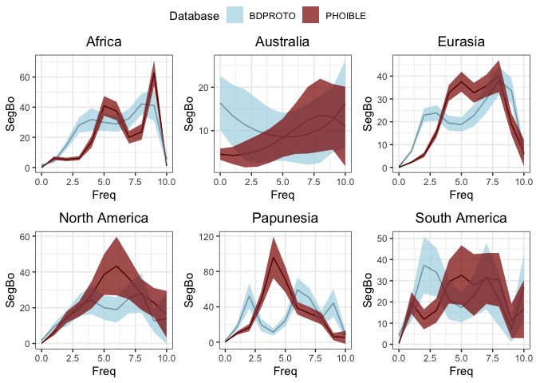<!-- -->

``` r
# Simple model (area-specific SegBo counts)
simp.area.macro.graphs = graph.collector(simp.area.macro)

ggarrange(plotlist = simp.area.macro.graphs, common.legend = T)
```

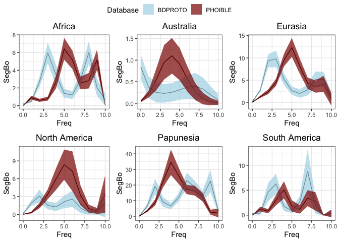<!-- -->

``` r
# Random effects (macroarea only)
rand.area.cross.graph = graph.collector(rand.area.cross, random = T)

# Random effects (macroarea only with area-specific SegBo)
rand.area.cross.macro.graph = graph.collector(rand.area.cross.macro, random = T)

# Random effects (macroarea and family crossed)
rand.area.fam.cross.graph = graph.collector(rand.area.fam.cross, family = T, random = T)

# Random effects (nested effects)
rand.nest.graph = graph.collector(rand.area.fam.nest, family = T, random = T, T)

ggarrange(rand.area.cross.graph, rand.area.fam.cross.graph, rand.nest.graph, common.legend = T)
```

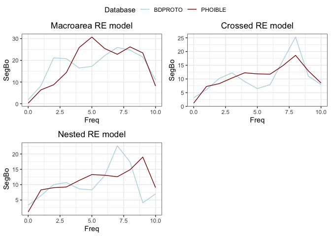<!-- -->

For the simple model by-area models (which most closely resemble the
overall model in structure), we see largely similar shapes for the
behavior of both BDPROTO and PHOIBLE frequencies. The major exceptions
are spikes in the high-frequency PHOIBLE range for Africa and Australia.
Further, Australia shows the most distinctive pattern, having a much
higher proportion of high-borrowability sounds.

For the random-effect models, the most stable features are (i) the
greater amount of high-borrowability sounds in the mid-frequency range
of PHOIBLE relative to BDPROTO and (ii) the rapid decreases on either
end of the frequency spectrum. We also see a much more pronounced effect
of BDPROTO in the high-frequency range (e.g., 7.5 in scaled frequency).
Finally, the random-effect models are more sensitive to the high-band
spikes for PHOIBLE that we observe for Africa, Eurasia, and Australia.

We now briefly explore the sounds that distinguish BDPROTO from PHOIBLE
in the higher frequency band for each corpus in the African area.

``` r
africa = mod.dat.area.intersect %>%
         filter(macroarea == "Africa" & 
                scaled.frequency < 9 & 
                scaled.frequency > 8.5) %>%
         arrange(Database, desc(SegBo))

africa
```

    ##   Database macroarea Phoneme frequency scaled.frequency SegBo SegBo.scaled
    ## 1  bdproto    Africa       b        24         8.846154    64    4.2857143
    ## 2  bdproto    Africa       d        24         8.846154    54    3.6054422
    ## 3  phoible    Africa       f       677         8.965517   148   10.0000000
    ## 4  phoible    Africa       d       642         8.501326    54    3.6054422
    ## 5  phoible    Africa       p       645         8.541114    48    3.1972789
    ## 6  phoible    Africa       l       651         8.620690    43    2.8571429
    ## 7  phoible    Africa       e       650         8.607427    25    1.6326531
    ## 8  phoible    Africa       t       671         8.885942     9    0.5442177

``` r
africa.macro = mod.dat.area.intersect.macro %>%
         filter(macroarea == "Africa" & 
                scaled.frequency < 9 & 
                scaled.frequency > 8.5) %>%
         arrange(Database, desc(SegBo))

africa.macro
```

    ##   Database macroarea Phoneme frequency scaled.frequency SegBo SegBo.scaled
    ## 1  bdproto    Africa       b        24         8.846154     4    2.1428571
    ## 2  bdproto    Africa       d        24         8.846154     3    1.4285714
    ## 3  phoible    Africa       p       645         8.541114    15   10.0000000
    ## 4  phoible    Africa       f       677         8.965517     9    5.7142857
    ## 5  phoible    Africa       l       651         8.620690     5    2.8571429
    ## 6  phoible    Africa       d       642         8.501326     3    1.4285714
    ## 7  phoible    Africa       t       671         8.885942     2    0.7142857
    ## 8  phoible    Africa       e       650         8.607427     0    0.0000000

The African macroarea can roughly be divided by the Saharan desert
region, with different types of languages appearing on either side (and
indeed, with differing contact environments). It is also the area for
which we have the most data, particularly in PHOIBLE (which allows us to
take a more fine-grained perspective on areal factors).
Methodologically, this excursus will determine to what extent the method
we have applied broadly to the world-level sample reveals some kernel of
truth about the behavior of well-defined subparts of the data.

To test whether this geographical and geneological divide can shed light
on the effects we have so far observed for the African macroarea, we
split the African languages up into two groups (northern and
subsaharan). We make this split in two ways. First, we split according
to latitude (languages which fall above latitude 23.806078, or what is
listed at <https://www.latlong.net/place/the-sahara-desert-17.html>).
Next, we split according to family, given that Afro-asiatic or
Nilo-Saharan languages are generally associated with the northern part
of the continent, and others with the subsaharan region.

``` r
# Load the glottocode data to get latitudes
glot = read.csv("./glottolog_data.csv", header=T, quote="", comment.char="")

# Function to split by families
fams.to.split = c("afro1255", "nilo1247")
fam.div = function(x) {
              output = ifelse(x %in% fams.to.split, "northern", "subsaharan")
              return(output)
}

# Function to split by latitudes
lat.div = function(x) {
              output = ifelse(x < 23.806078, "subsaharan", "northern")
              return(output)
}


# Label African data for position (northern, subsaharan) by both methods
africa.dat = all.dat %>%
             left_join(., glot[, c(1, 6)], by="Glottocode") %>%
             filter(macroarea == "Africa") %>%
             mutate(fam.class = fam.div(family_id_simplified), 
                    lat.class = lat.div(as.numeric(latitude))) %>%
             as.data.frame()
             
# Fill NAs in latitude measurements based on the family-based estimates 
africa.dat$lat.class = as.factor(ifelse(africa.dat$lat.class %in% fams.to.split &
                                        is.na(africa.dat$lat.class),
                                        "northern", as.vector(africa.dat$lat.class)))

africa.dat$lat.class = as.factor(ifelse(!africa.dat$lat.class %in% fams.to.split &
                                        is.na(africa.dat$lat.class),
                                        "subsaharan", as.vector(africa.dat$lat.class)))


segbo.freqs.africa.famSplit = africa.dat %>%
                              filter(Database == "segbo") %>%
                              group_by(fam.class, Phoneme) %>%
                              summarize(SegBo = n()) %>%
                              mutate(SegBo.scaled = scaling.func(SegBo)) %>%
                              as.data.frame()

segbo.freqs.africa.latSplit = africa.dat %>%
                              filter(Database == "segbo") %>%
                              group_by(lat.class, Phoneme) %>%
                              summarize(SegBo = n()) %>%
                              mutate(SegBo.scaled = scaling.func(SegBo)) %>%
                              as.data.frame()


# Compute the frequencies by area within the African continent (family-based split)
mod.dat.africa.famSplit =  africa.dat %>% 
                           filter(family_id_simplified %in% shared.fams &
                                 macroarea == "Africa") %>%
                           group_by(Database, fam.class, Phoneme) %>%
                           summarize(frequency = n()) %>%
                           group_by(Database, fam.class) %>%
                           mutate(scaled.frequency = scaling.func(frequency))

#### ... and add SegBo as a new column (family-based split)
mod.dat.africa.famSplit = mod.dat.africa.famSplit %>%
                          filter(Database != "segbo") %>%
                          left_join(., segbo.freqs.africa.famSplit,
                                    by = c("fam.class", "Phoneme")) %>%
                          replace_na(., list(SegBo=0, SegBo.scaled=0)) %>%
                          as.data.frame() %>%
                          droplevels()

# Compute the frequencies by area within the African continent (family-based split)
mod.dat.africa.latSplit =  africa.dat %>% 
                           filter(family_id_simplified %in% shared.fams &
                                 macroarea == "Africa") %>%
                           group_by(Database, lat.class, Phoneme) %>%
                           summarize(frequency = n()) %>%
                           group_by(Database, lat.class) %>%
                           mutate(scaled.frequency = scaling.func(frequency))

#### ... and add SegBo as a new column (family-based split)
mod.dat.africa.latSplit = mod.dat.africa.latSplit %>%
                          filter(Database != "segbo") %>%
                          left_join(., segbo.freqs.africa.latSplit,
                                    by = c("lat.class", "Phoneme")) %>%
                          replace_na(., list(SegBo=0, SegBo.scaled=0)) %>%
                          as.data.frame() %>%
                          droplevels()
```

Now we can run the same analysis we did before, only this time looking
at each area of the African continent separately (and once each for the
family-based vs. latitude-based estimates of where to split).

``` r
# Compute the models (to save time, we change the "X.class" variables to macroarea)
colnames(mod.dat.africa.famSplit)[2] = "macroarea"
colnames(mod.dat.africa.latSplit)[2] = "macroarea"

africa.mods.famSplit = iter.mod.fnc.simp(mod.dat.africa.famSplit, F, "simple")
africa.mods.latSplit = iter.mod.fnc.simp(mod.dat.africa.latSplit, F, "simple", lat = T)

# Family-based split graphs
africa.graphs.famSplit = graph.collector(africa.mods.famSplit)

ggarrange(plotlist = africa.graphs.famSplit, common.legend = T)
```

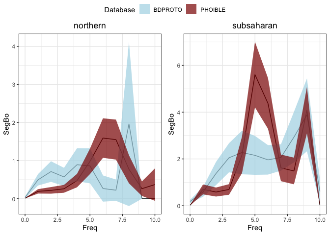<!-- -->

``` r
# Latitude-based split graphs
africa.graphs.latSplit = graph.collector(africa.mods.latSplit)

ggarrange(plotlist = africa.graphs.latSplit, common.legend = T)
```

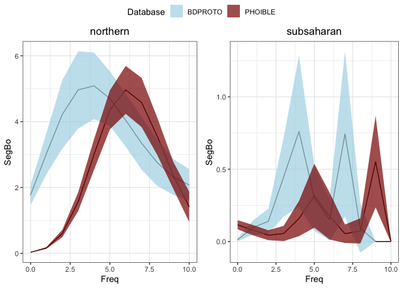<!-- -->
These plots reveal that the southern languages are the ones driving the
secondary spike. The method of distinguishing within-Africa areas does
not seem to affect this particular pattern. The method of selecting the
northern area does, however, have a significant impact on the shape of
the BDPROTO estimates (but not PHOIBLE). There is remarkable
consistency, however, between these “micro”-areas and the plots we have
observed elsewhere: an asymmetry at the low-end of the frequency
spectrum (higher borrowability for BDPROTO sounds), as well as higher
borrowability for PHOIBLE vis-a-vis BDPROTO in the middle range (though
this is less pronounced in the latitude-based model).

Indeed, both modern and ancient languages in this area contain highly
borrowable sounds. Perhpas this occurs through preservation of these
sorts of sounds, or perhaps the sounds themselves differ between the two
databases. We check this now.

``` r
africa.fam = mod.dat.africa.famSplit %>%
             filter(macroarea == "subsaharan" & 
                scaled.frequency < 9.5 & 
                scaled.frequency > 7) %>%
             arrange(Database, desc(SegBo))

africa.fam
```

    ##    Database  macroarea Phoneme frequency scaled.frequency SegBo
    ## 1   bdproto subsaharan       p        11         7.692308    11
    ## 2   bdproto subsaharan       ɡ        12         8.461538     6
    ## 3   bdproto subsaharan       b        13         9.230769     3
    ## 4   bdproto subsaharan       d        13         9.230769     2
    ## 5   bdproto subsaharan       s        12         8.461538     2
    ## 6   bdproto subsaharan       ɲ        11         7.692308     0
    ## 7   phoible subsaharan       p       526         8.793970    11
    ## 8   phoible subsaharan       f       554         9.262982     8
    ## 9   phoible subsaharan       ɡ       527         8.810720     6
    ## 10  phoible subsaharan       l       505         8.442211     4
    ## 11  phoible subsaharan       b       552         9.229481     3
    ## 12  phoible subsaharan       d       503         8.408710     2
    ## 13  phoible subsaharan       s       568         9.497487     2
    ## 14  phoible subsaharan       t       533         8.911223     2
    ## 15  phoible subsaharan       e       541         9.045226     0
    ## 16  phoible subsaharan       ɛ       442         7.386935     0
    ## 17  phoible subsaharan       n       557         9.313233     0
    ## 18  phoible subsaharan       ɲ       470         7.855946     0
    ## 19  phoible subsaharan       ŋ       452         7.554439     0
    ## 20  phoible subsaharan       o       535         8.944724     0
    ## 21  phoible subsaharan       ɔ       476         7.956449     0
    ##    SegBo.scaled
    ## 1            10
    ## 2             5
    ## 3             2
    ## 4             1
    ## 5             1
    ## 6             0
    ## 7            10
    ## 8             7
    ## 9             5
    ## 10            3
    ## 11            2
    ## 12            1
    ## 13            1
    ## 14            1
    ## 15            0
    ## 16            0
    ## 17            0
    ## 18            0
    ## 19            0
    ## 20            0
    ## 21            0

``` r
africa.lat = mod.dat.africa.latSplit %>%
             filter(macroarea == "subsaharan" & 
                    scaled.frequency < 9.5 & 
                    scaled.frequency > 7) %>%
             arrange(Database, desc(SegBo))

africa.lat
```

    ##    Database  macroarea Phoneme frequency scaled.frequency SegBo
    ## 1   bdproto subsaharan       l        18         7.391304     2
    ## 2   bdproto subsaharan       p        19         7.826087     1
    ## 3   bdproto subsaharan       b        22         9.130435     0
    ## 4   bdproto subsaharan       d        22         9.130435     0
    ## 5   bdproto subsaharan       ɡ        21         8.695652     0
    ## 6   bdproto subsaharan       j        19         7.826087     0
    ## 7   bdproto subsaharan       s        19         7.826087     0
    ## 8   bdproto subsaharan       w        20         8.260870     0
    ## 9   phoible subsaharan       l        19         9.000000     2
    ## 10  phoible subsaharan       p        19         9.000000     1
    ## 11  phoible subsaharan       a        18         8.500000     0
    ## 12  phoible subsaharan       b        18         8.500000     0
    ## 13  phoible subsaharan       d        18         8.500000     0
    ## 14  phoible subsaharan       ɡ        17         8.000000     0
    ## 15  phoible subsaharan       j        18         8.500000     0
    ## 16  phoible subsaharan       k        19         9.000000     0
    ## 17  phoible subsaharan       r        16         7.500000     0
    ## 18  phoible subsaharan       w        19         9.000000     0
    ##    SegBo.scaled
    ## 1            10
    ## 2             0
    ## 3             0
    ## 4             0
    ## 5             0
    ## 6             0
    ## 7             0
    ## 8             0
    ## 9            10
    ## 10            0
    ## 11            0
    ## 12            0
    ## 13            0
    ## 14            0
    ## 15            0
    ## 16            0
    ## 17            0
    ## 18            0

Thus, the similarity in the family-based split plot between BDPROTO and
PHOIBLE (the second spike) is most likely attributable to the sounds /p/
and /g/, which are shared between the the databases in this frequency
range.

We next examine the segments that fall in the frequency bands which best
distinguish PHOIBLE and BDPROTO (according to the overall model)
regarding their respective similarities to SegBo. This is similar to
what we do with the LOO sampling above; however, in this case, we are
interested in which segments contribute to the difference in similarity
between PHOIBLE and BDPROTO to SegBo, as opposed to looking at which
segments distinguish any single pair of databases from each other.

``` r
find.segs = function(df, min, max, sourceDB){
                     out.df = df %>%
                              filter(Frequency.source == sourceDB & 
                                     Frequency.scaled >= min &
                                     Frequency.scaled <= max) %>%
                              arrange(-segbo)
                     return(out.df)
}

# Scale segbo frequencies
segbo.scaled = data.frame(Phoneme = intersect_families_segments_long$Phoneme, segbo.scaled = scaling.func(intersect_families_segments_long$segbo))

# Middle values of x-axis
## BDPROTO
diff.bdproto.mid = find.segs(bd.pho.contrast.allsegs[[3]], 3, 6, "bdproto")
diff.bdproto.mid = left_join(diff.bdproto.mid, segbo.scaled, by="Phoneme")
diff.bdproto.mid$Phoneme
```

    ##  [1] "ɡ"  "h"  "o"  "e"  "ts" "ŋ"  "ʔ"  "ɲ"  "eː" "aː" "iː" "uː"

``` r
## PHOIBLE
diff.phoible.mid = find.segs(bd.pho.contrast.allsegs[[3]], 3, 6, "phoible")
diff.phoible.mid = left_join(diff.phoible.mid, segbo.scaled, by="Phoneme")
diff.phoible.mid$Phoneme
```

    ##  [1] "f"  "d̠ʒ" "t̠ʃ" "h"  "z"  "v"  "r"  "d"  "ʃ"  "ʔ"  "ɲ"  "ɛ"  "ɔ"  "aː"
    ## [15] "iː" "uː"

``` r
# Low values of x-axis
## BDPROTO
diff.bdproto.low = find.segs(bd.pho.contrast.allsegs[[3]], 0, 2.5, "bdproto")
diff.bdproto.low = left_join(diff.bdproto.low, segbo.scaled, by="Phoneme")
head(diff.bdproto.low$Phoneme, 20)
```

    ##  [1] "f"  "d̠ʒ" "t̠ʃ" "v"  "ʒ"  "ɾ"  "ɣ"  "ʕ"  "q"  "ɛ"  "ə"  "dz" "ʎ"  "ɸ" 
    ## [15] "ħ"  "ɔ"  "ɟ"  "pʰ" "β"  "χ"

``` r
## PHOIBLE
diff.phoible.low = find.segs(bd.pho.contrast.allsegs[[3]], 0, 2.5, "phoible")
diff.phoible.low = left_join(diff.phoible.low, segbo.scaled, by="Phoneme")
head(diff.phoible.low$Phoneme, 20)
```

    ##  [1] "ʒ"  "x"  "ts" "ɣ"  "ʕ"  "q"  "ə"  "dz" "ʎ"  "ɸ"  "ħ"  "c"  "ɟ"  "pʰ"
    ## [15] "β"  "χ"  "ð"  "ðˤ" "oː" "kʰ"

Because vowels are in general less likely to be borrowed than
consonants, and certain sounds are more difficult/less likely to
reconstruct (e.g., labiodentals), we restrict our dataset in two
additional ways. First, we rerun the above analysis only on consonants.
Then, we do the same, but removing labiodentals /f,v/ from the
databases.

``` r
fam.seg = left_join(intersect_families_segments_long, 
                    unique(all_dbs_all_segments[,c("Phoneme", "SegmentClass")]),
                    by = "Phoneme")

###########################################
# Keep consonants, but not vowels and tones
###########################################
fam.con = fam.seg %>% filter(SegmentClass == "consonant")
fam.con.contrast = freq.mod(fam.con, "BDPROTO vs. PHOIBLE (consonants)")
anova(fam.con.contrast[[1]], test="Chisq")
```

    ## Analysis of Deviance Table
    ## 
    ## Model: quasipoisson, link: log
    ## 
    ## Response: segbo
    ## 
    ## Terms added sequentially (first to last)
    ## 
    ## 
    ##                                            Df Deviance Resid. Df
    ## NULL                                                        3363
    ## poly(Frequency.scaled, 7)                   7  14845.2      3356
    ## Frequency.source                            1     33.3      3355
    ## poly(Frequency.scaled, 7):Frequency.source  7    232.7      3348
    ##                                            Resid. Dev  Pr(>Chi)    
    ## NULL                                          18606.8              
    ## poly(Frequency.scaled, 7)                      3761.5 < 2.2e-16 ***
    ## Frequency.source                               3728.2 0.0003589 ***
    ## poly(Frequency.scaled, 7):Frequency.source     3495.6 < 2.2e-16 ***
    ## ---
    ## Signif. codes:  0 '***' 0.001 '**' 0.01 '*' 0.05 '.' 0.1 ' ' 1

``` r
poisson.consonants.all = fam.con.contrast[[2]]; poisson.consonants.all
```

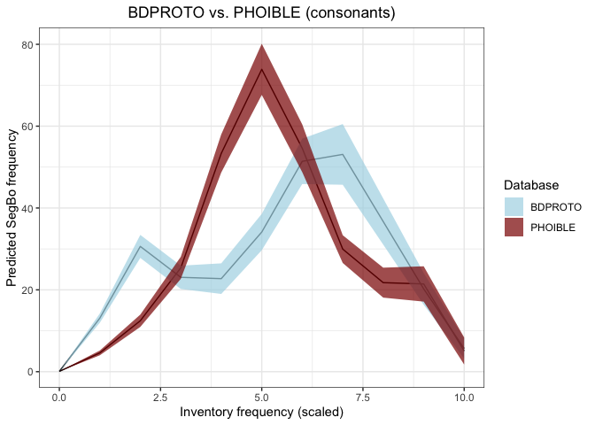<!-- -->

``` r
# Middle values of x-axis
## BDPROTO
diff.bdproto.mid.con = find.segs(fam.con.contrast[[3]], 3, 6, "bdproto")
diff.bdproto.mid.con$Phoneme
```

    ## [1] "ɡ"  "h"  "ts" "ŋ"  "ʔ"  "ɲ"

``` r
## PHOIBLE
diff.phoible.mid.con = find.segs(fam.con.contrast[[3]], 3, 6, "phoible")
diff.phoible.mid.con$Phoneme
```

    ##  [1] "f"  "d̠ʒ" "t̠ʃ" "h"  "z"  "v"  "r"  "d"  "ʃ"  "ʔ"  "ɲ"

``` r
# Low values of x-axis
## BDPROTO
diff.bdproto.low.con = find.segs(fam.con.contrast[[3]], 0, 2.5, "bdproto")
head(diff.bdproto.low.con$Phoneme, 20)
```

    ##  [1] "f"  "d̠ʒ" "t̠ʃ" "v"  "ʒ"  "ɾ"  "ɣ"  "ʕ"  "q"  "dz" "ʎ"  "ɸ"  "ħ"  "ɟ" 
    ## [15] "pʰ" "β"  "χ"  "ð"  "ðˤ" "kʰ"

``` r
## PHOIBLE
diff.phoible.low.con = find.segs(fam.con.contrast[[3]], 0, 2.5, "phoible")
head(diff.phoible.low.con$Phoneme, 20)
```

    ##  [1] "ʒ"  "x"  "ts" "ɣ"  "ʕ"  "q"  "dz" "ʎ"  "ɸ"  "ħ"  "c"  "ɟ"  "pʰ" "β" 
    ## [15] "χ"  "ð"  "ðˤ" "kʰ" "mb" "ɬ"

``` r
################################################################
# Knock out labiodentals, but keep consonants, vowels, and tones
#@@@@@@@@@@@@@@@@@@@@@@@@@@@@@@@@@@@@@@@@@@@@@@@@@@@@@@@@@@@@@@@
fam.sans.ld = fam.seg %>% filter(!fam.seg$Phoneme %in% c("f", "v"))
fam.sans.ld.contrast = freq.mod(fam.sans.ld, "BDPROTO vs. PHOIBLE (no labiodentals)")
anova(fam.sans.ld.contrast[[1]], test="Chisq")
```

    ## Analysis of Deviance Table
    ## 
    ## Model: quasipoisson, link: log
    ## 
    ## Response: segbo
    ## 
    ## Terms added sequentially (first to last)
    ## 
    ## 
    ##                                            Df Deviance Resid. Df
    ## NULL                                                        5549
    ## poly(Frequency.scaled, 7)                   7  14447.7      5542
    ## Frequency.source                            1     17.2      5541
    ## poly(Frequency.scaled, 7):Frequency.source  7    129.9      5534
    ##                                            Resid. Dev  Pr(>Chi)    
    ## NULL                                          18936.4              
    ## poly(Frequency.scaled, 7)                      4488.7 < 2.2e-16 ***
    ## Frequency.source                               4471.5  0.006552 ** 
    ## poly(Frequency.scaled, 7):Frequency.source     4341.6 1.084e-09 ***
    ## ---
    ## Signif. codes:  0 '***' 0.001 '**' 0.01 '*' 0.05 '.' 0.1 ' ' 1

``` r
poisson.nold.all = fam.sans.ld.contrast[[2]]; poisson.nold.all
```

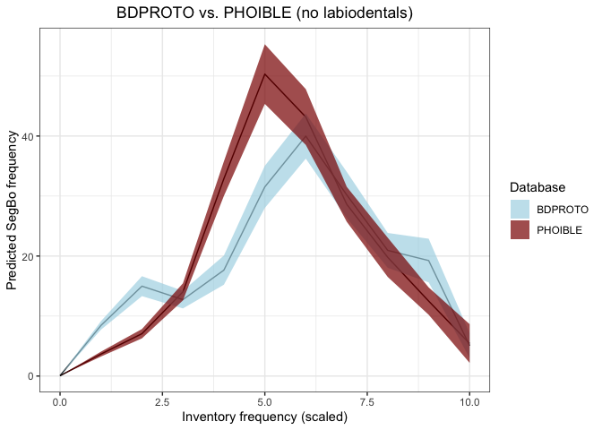<!-- -->

``` r
# Middle values of x-axis
## BDPROTO
diff.bdproto.mid.ld = find.segs(fam.sans.ld.contrast[[3]], 3, 6, "bdproto")
diff.bdproto.mid.ld$Phoneme
```

    ##  [1] "ɡ"  "h"  "o"  "e"  "ts" "ŋ"  "ʔ"  "ɲ"  "eː" "aː" "iː" "uː"

``` r
## PHOIBLE
diff.phoible.mid.ld = find.segs(fam.sans.ld.contrast[[3]], 3, 6, "phoible")
diff.phoible.mid.ld$Phoneme
```

    ##  [1] "d̠ʒ" "t̠ʃ" "h"  "z"  "r"  "d"  "ʃ"  "ʔ"  "ɲ"  "ɛ"  "ɔ"  "aː" "iː" "uː"

``` r
# Low values of x-axis
## BDPROTO
diff.bdproto.low.ld = find.segs(fam.sans.ld.contrast[[3]], 0, 2.5, "bdproto")
head(diff.bdproto.low.ld$Phoneme, 20)
```

    ##  [1] "d̠ʒ" "t̠ʃ" "ʒ"  "ɾ"  "ɣ"  "ʕ"  "q"  "ɛ"  "ə"  "dz" "ʎ"  "ɸ"  "ħ"  "ɔ" 
    ## [15] "ɟ"  "pʰ" "β"  "χ"  "ð"  "ðˤ"

``` r
## PHOIBLE
diff.phoible.low.ld = find.segs(fam.sans.ld.contrast[[3]], 0, 2.5, "phoible")
head(diff.phoible.low.ld$Phoneme, 20)
```

    ##  [1] "ʒ"  "x"  "ts" "ɣ"  "ʕ"  "q"  "ə"  "dz" "ʎ"  "ɸ"  "ħ"  "c"  "ɟ"  "pʰ"
    ## [15] "β"  "χ"  "ð"  "ðˤ" "oː" "kʰ"

``` r
######################################################
# Knock out labiodentals, but only consider consonants
######################################################
fam.con.sans.ld = fam.sans.ld %>% filter(SegmentClass == "consonant")
fam.con.sans.ld.contrast = freq.mod(fam.con.sans.ld, "BDPROTO vs. PHOIBLE (consonants, no labiodentals)")
anova(fam.con.sans.ld.contrast[[1]], test="Chisq")
```

    ## Analysis of Deviance Table
    ## 
    ## Model: quasipoisson, link: log
    ## 
    ## Response: segbo
    ## 
    ## Terms added sequentially (first to last)
    ## 
    ## 
    ##                                            Df Deviance Resid. Df
    ## NULL                                                        3359
    ## poly(Frequency.scaled, 7)                   7  12397.6      3352
    ## Frequency.source                            1     19.1      3351
    ## poly(Frequency.scaled, 7):Frequency.source  7     88.4      3344
    ##                                            Resid. Dev  Pr(>Chi)    
    ## NULL                                          15632.9              
    ## poly(Frequency.scaled, 7)                      3235.2 < 2.2e-16 ***
    ## Frequency.source                               3216.1  0.005631 ** 
    ## poly(Frequency.scaled, 7):Frequency.source     3127.8 9.138e-06 ***
    ## ---
    ## Signif. codes:  0 '***' 0.001 '**' 0.01 '*' 0.05 '.' 0.1 ' ' 1

``` r
poisson.consonants.nold.all = fam.con.sans.ld.contrast[[2]]; poisson.consonants.nold.all
```

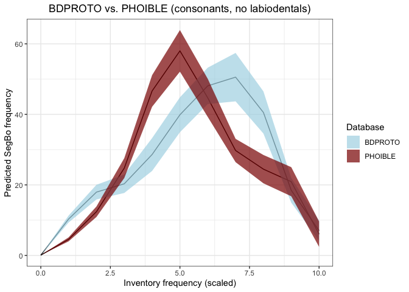<!-- -->

``` r
# Middle values of x-axis
## BDPROTO
diff.bdproto.mid.ld = find.segs(fam.con.sans.ld.contrast[[3]], 3, 6, "bdproto")
diff.bdproto.mid.ld$Phoneme
```

    ## [1] "ɡ"  "h"  "ts" "ŋ"  "ʔ"  "ɲ"

``` r
## PHOIBLE
diff.phoible.mid.ld = find.segs(fam.con.sans.ld.contrast[[3]], 3, 6, "phoible")
diff.phoible.mid.ld$Phoneme
```

    ## [1] "d̠ʒ" "t̠ʃ" "h"  "z"  "r"  "d"  "ʃ"  "ʔ"  "ɲ"

``` r
# Low values of x-axis
## BDPROTO
diff.bdproto.low.ld = find.segs(fam.con.sans.ld.contrast[[3]], 0, 2.5, "bdproto")
head(diff.bdproto.low.ld$Phoneme, 20)
```

    ##  [1] "d̠ʒ" "t̠ʃ" "ʒ"  "ɾ"  "ɣ"  "ʕ"  "q"  "dz" "ʎ"  "ɸ"  "ħ"  "ɟ"  "pʰ" "β" 
    ## [15] "χ"  "ð"  "ðˤ" "kʰ" "mb" "ɬ"

``` r
## PHOIBLE
diff.phoible.low.ld = find.segs(fam.con.sans.ld.contrast[[3]], 0, 2.5, "phoible")
head(diff.phoible.low.ld$Phoneme, 20)
```

    ##  [1] "ʒ"  "x"  "ts" "ɣ"  "ʕ"  "q"  "dz" "ʎ"  "ɸ"  "ħ"  "c"  "ɟ"  "pʰ" "β" 
    ## [15] "χ"  "ð"  "ðˤ" "kʰ" "mb" "ɬ"

By considering only consonants, we do not observe a significant change
in the behavior of the two databases. However, removing labiodentals
(everything else held constant), draws BDPROTO and PHOIBLE into much
closer alignment. Nevertheless, we still observe the crossing at roughly
2.5 on the x-axis, with too few mid-borrowability forms in BDPROTO and a
stronger peak in PHOIBLE for mid-level frequencies. The image is a bit
more difficult when we consider only consonants without the
labiodentals. In this case, we see a stronger peak for BDPROTO in the
higher frequncy ranges (i.e., BDPROTO contains more instances of sounds
that are also highly borrowable). But the general picture is similar,
and we still observe the cross-over in the lower frequency ranges. In
other words, BDPROTO has too few mid-level borrowable segments and too
many low- and high-borrowability segments relative to PHOIBLE.

*Interpretation*: Over time, the most borrowable sounds are drawn
towards the median frequency band across languages. Conversely, the
least borrowable sounds are drawn to the extremes of the frequency
range. This fits with the idea that both typologically dispreferred
sounds (e.g., sounds that are rare because they are difficult to
articulate/perceive) and sounds that are typologically heavily preferred
(i.e., the sounds that languages tend to already have) are the least
likely to be borrowed in contact scenarios.

Also, as Eitan points out, the largest discrepancy between BDPROTO and
PHOIBLE arises for those sounds that are the most frequent in SegBo.

**Section 2**: Random resampling to guard against biases in the
databases

First, we define some functions to perform the resampling.

``` r
# Function to generate frequency distributions by one of two methods:
# one sound per language ("ospl") or one inventory per family ("oipf")
sampling.fnc = function(df, method){
    # OSPL
    if(method=="ospl"){
        seg.df = df %>% group_by(InventoryID) %>%
                            summarize(Phoneme = sample(Phoneme,1))
        seg.cts = seg.df %>% group_by(Phoneme) %>%
                          summarize(Frequency = n())
    }
    # OIPF    
    else if(method=="oipf"){
        seg.list = list()
        fams = unique(df$family_id_simplified)
        i=1
        for(fam in fams){
            langs = unique(df$InventoryID[df$family_id_simplified==fam])
            lang = sample(langs,1)
            curr.segs = df[df$InventoryID==lang, c("Phoneme", "InventoryID")]
            seg.list[[i]] = curr.segs
            i = i+1
        }
        seg.df = do.call(rbind, seg.list)
        seg.cts = seg.df %>% group_by(Phoneme) %>%
                             summarize(Frequency = n())
    }
    output.df = as.data.frame(seg.cts)
    return(output.df)
}

# Function to combine and compare randomly generated distributions
iter.jsd = function(df, k, segment.class, geo, db.p, db.q, method, distinctiveSegbo=F){
      if(distinctiveSegbo==T){
          seg = as.vector(df$Glottocode[df$Database=="segbo"])
          oth = as.vector(df$Glottocode[df$Database==db.p])
          shared.langs = intersect(seg, oth)
          new.df.p = df[!df$Glottocode %in% shared.langs,]
      }
      new.df.p = df %>% filter(SegmentClass %in% c(segment.class) &
                           macroarea %in% c(geo) &
                           Database %in% c(db.p))
      new.df.q = df %>% filter(SegmentClass %in% c(segment.class) &
                           macroarea %in% c(geo) &
                           Database %in% c(db.q))
      pTqT.vec = vector()
      pTqF.vec = vector()
      pFqT.vec = vector()
      pFqF.vec = vector()
      for(i in 1:k){
          p.sample.true = sampling.fnc(new.df.p, method)
          p.sample.random = data.frame(Phoneme = p.sample.true$Phoneme,
                                       Frequency = sample(p.sample.true$Frequency))
          q.sample.true = sampling.fnc(new.df.q, method)
          q.sample.random = data.frame(Phoneme = q.sample.true$Phoneme,
                                       Frequency = sample(q.sample.true$Frequency))
          pTqT = merge(p.sample.true, q.sample.true, all = T, by="Phoneme")
          pTqT = as.data.frame(apply(pTqT[,2:3], 2, function(x){ifelse(is.na(x), 0, x)}))
          pTqF = merge(p.sample.true, q.sample.random, all = T, by="Phoneme")
          pTqF = as.data.frame(apply(pTqF[,2:3], 2, function(x){ifelse(is.na(x), 0, x)}))          
          pFqT = merge(p.sample.random, q.sample.true, all = T, by="Phoneme")
          pFqT = as.data.frame(apply(pFqT[,2:3], 2, function(x){ifelse(is.na(x), 0, x)}))    
          pFqF = merge(p.sample.random, q.sample.random, all = T, by="Phoneme")
          pFqF = as.data.frame(apply(pFqF[,2:3], 2, function(x){ifelse(is.na(x), 0, x)}))   
          # Estimate JSDs for each comparison
          pTqT.jsd = JSD(t(pTqT), est.prob="empirical")
          pTqF.jsd = JSD(t(pTqF), est.prob="empirical")
          pFqT.jsd = JSD(t(pFqT), est.prob="empirical")
          pFqF.jsd = JSD(t(pFqF), est.prob="empirical")
          pTqT.vec = c(pTqT.vec, pTqT.jsd)
          pTqF.vec = c(pTqF.vec, pTqF.jsd)
          pFqT.vec = c(pFqT.vec, pFqT.jsd)
          pFqF.vec = c(pFqF.vec, pFqF.jsd)
      }
      total.length = sum(length(pTqT.vec),
                         length(pTqF.vec),
                         length(pFqT.vec),
                         length(pFqF.vec))
      output.df = data.frame(JSD = c(pTqT.vec, 
                                     pTqF.vec, 
                                     pFqT.vec, 
                                     pFqF.vec), 
                             CompType = c(rep("True-True", 
                                              length(pTqT.vec)),
                                          rep("True-False",
                                              length(pTqF.vec)),
                                          rep("False-True",
                                              length(pFqT.vec)),
                                          rep("False-False",
                                              length(pFqF.vec))),
                              SegmentClass = rep(paste(segment.class, collapse="+"), 
                                               total.length),
                              macroarea = gsub(" ", "_", rep(paste(geo, collapse="+"),
                                              total.length), perl=T),
                              db.p = rep(db.p,
                                         total.length),
                              db.q = rep(db.q,
                                         total.length),
                              method = rep(method,
                                           total.length))
      return(output.df)
}

# Function to perform the whole analysis over each of the various variable combinations
iter.param = function(df, k, distinctiveSegbo=F){
    db.ps = unique(df$Database)
    db.qs = unique(df$Database)
    segment.classes = c("consonant", "vowel", "cv")
    macroareas = c(unique(df$macroarea), "all")
    methods = c("ospl", "oipf")
    p.space = expand.grid(db.p = db.ps,
                          db.q = db.qs,
                          SegmentClass = segment.classes, 
                          macroarea = macroareas, 
                          method = methods)
    p.space = droplevels(p.space[p.space$db.p != p.space$db.q,])
    p.space = droplevels(p.space[(p.space$db.q != "bdproto") &
                       (p.space$db.p != "segbo"),])
    p.space = na.omit(p.space)
    jsd.list = list()
    for(i in 1:nrow(p.space)){
        if(p.space$SegmentClass[[i]] == "cv"){
            seg.arg = c("consonant", "vowel")
        }
        else{
            seg.arg = as.vector(p.space$SegmentClass[i])
        }
        if(p.space$macroarea[[i]] == "all"){
            area.arg = as.vector(unique(df$macroarea))
        }
        else{
            area.arg = as.vector(p.space$macroarea[[i]])
        }
        if(distinctiveSegbo == T){
            current.iter = iter.jsd(df, 
                                    k,
                                    seg.arg, 
                                    area.arg,
                                    as.vector(p.space$db.p[i]),
                                    as.vector(p.space$db.q[i]),
                                    as.vector(p.space$method[i]),
                                    T)
        }
        else{
            current.iter = iter.jsd(df, 
                                    k,
                                    seg.arg, 
                                    area.arg,
                                    as.vector(p.space$db.p[i]),
                                    as.vector(p.space$db.q[i]),
                                    as.vector(p.space$method[i]))
        }
        jsd.list[[i]] = current.iter
    }
    output.df = do.call(rbind, jsd.list)
    return(output.df)
}

# Function to plot the distributions of the JSD values
distPlotter = function(df, title, seg.class, geo, source.db, target.db, sampleType, contrastType, comp.type=NULL){
      if(contrastType=="within"){
          plot.df = df %>% filter(SegmentClass == seg.class,
                                  macroarea == geo,
                                  db.p == source.db,
                                  db.q == target.db,
                                  method == sampleType)
          p = ggplot(plot.df, aes(y=JSD, x=CompType)) +
              geom_violin(fill="dodgerblue") +
              xlab("Type of comparison") + 
              ggtitle(title) + 
              theme_bw() +
              theme(plot.title = element_text(hjust = 0.5))
      }
      else{
          plot.df = df %>% filter(SegmentClass == seg.class,
                                  macroarea == geo,
                                  CompType == comp.type,
                                  method == sampleType)
          p = ggplot(plot.df, aes(y=JSD, x=PtoQ)) +
              geom_violin(fill="dodgerblue") +
              xlab("Type of comparison") + 
              ggtitle(title) + 
              theme_bw() +
              theme(plot.title = element_text(hjust = 0.5))
      }
      
      return(p)
}
```

Now we can do the resampling (500 iterations per parameter set), as well
as some plotting.

``` r
resampling.df = suppressMessages(iter.param(all_dbs_all_segments, k=500))

cols = c("db.p", "db.q")
resampling.df$PtoQ = as.factor(apply(as.data.frame(resampling.df[ ,cols]), 1, paste, collapse = " > "))

# Some cleanup
resampling.df$macroarea = as.factor(ifelse(resampling.df$macroarea == "Eurasia+Africa+South_America+Papunesia+North_America+Australia", "all", as.vector(resampling.df$macroarea)))

# Consonants and vowels, all macroareas, OSPL sampling
## Within (i.e., comparing scrambled to true distributions)
### BDPROTO vs. PHOIBLE
distPlotter(resampling.df,
            "Within BDPROTO > PHOIBLE: OSPL - CV - all areas",
            "consonant+vowel", "all",
            "BDPROTO",
            "PHOIBLE",
            "ospl",
            "within")
```

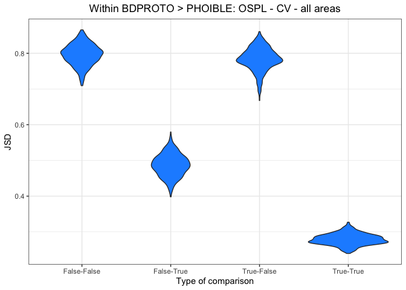<!-- -->

``` r
### BDPROTO vs. SegBo
distPlotter(resampling.df,
            "Within BDPROTO > SegBo: OSPL - CV - all areas",
            "consonant+vowel", "all",
            "BDPROTO",
            "SegBo",
            "ospl",
            "within")
```

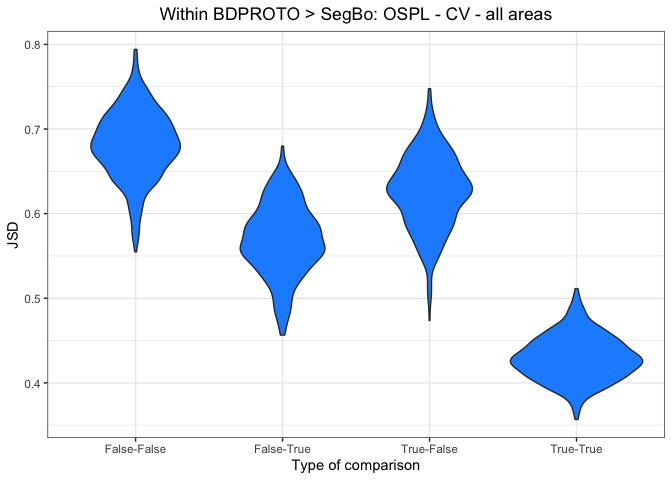<!-- -->

``` r
### PHOIBLE vs. SegBo
distPlotter(resampling.df,
            "Within PHOIBLE > SegBo: OSPL - CV - all areas",
            "consonant+vowel", "all",
            "PHOIBLE",
            "SegBo",
            "ospl",
            "within")
```

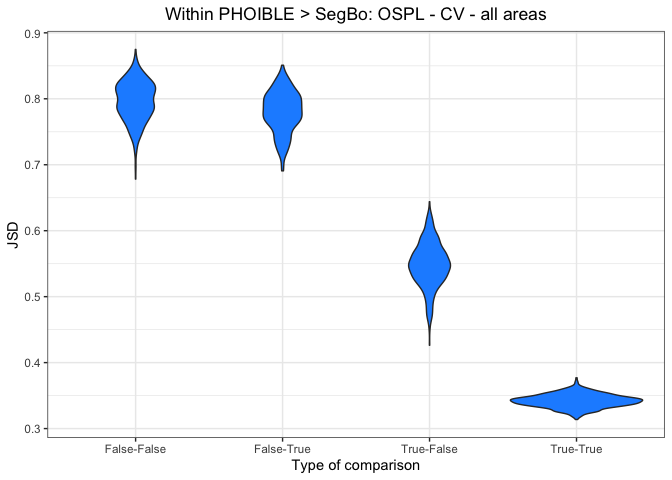<!-- -->

``` r
## Across (i.e., comparing similarity across contrasts)
distPlotter(resampling.df,
            "Across databases: OSPL - CV - all areas",
            "consonant+vowel", "all",
            "BDPROTO",
            "PHOIBLE",
            "ospl",
            "across",
            "True-True")
```

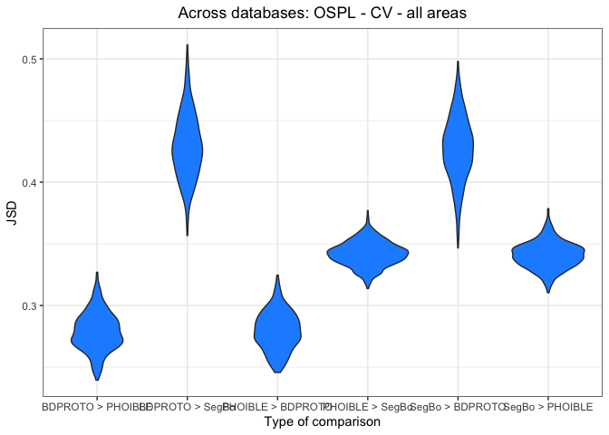<!-- -->

``` r
# Consonants and vowels, all macroareas, OIPF sampling
## Within (i.e., comparing scrambled to true distributions)
### BDPROTO vs. PHOIBLE
distPlotter(resampling.df,
            "Within BDPROTO > PHOIBLE: OIPF - CV - all areas",
            "consonant+vowel", "all",
            "BDPROTO",
            "PHOIBLE",
            "oipf",
            "within")
```

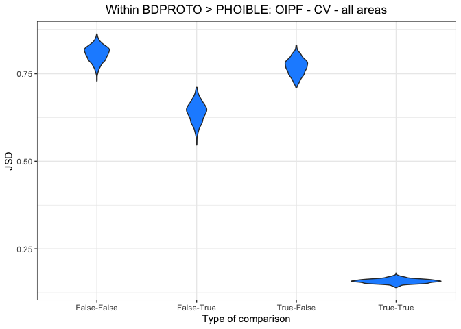<!-- -->

``` r
### BDPROTO vs. SegBo
distPlotter(resampling.df,
            "Within BDPROTO > SegBo: OIPF - CV - all areas",
            "consonant+vowel", "all",
            "BDPROTO",
            "SegBo",
            "oipf",
            "within")
```

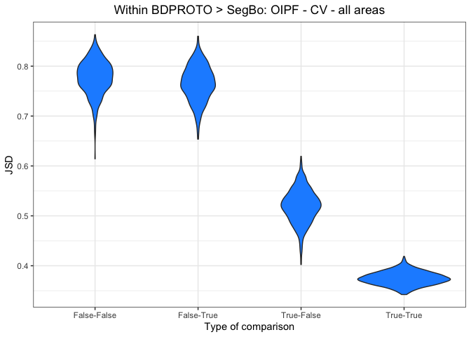<!-- -->

``` r
### PHOIBLE vs. SegBo
distPlotter(resampling.df,
            "Within PHOIBLE > SegBo: OIPF - CV - all areas",
            "consonant+vowel", "all",
            "PHOIBLE",
            "SegBo",
            "oipf",
            "within")
```

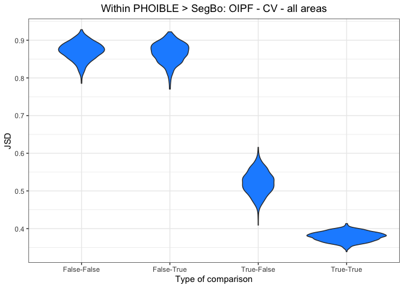<!-- -->

``` r
## Across (i.e., comparing similarity across contrasts)
distPlotter(resampling.df,
            "Across databases: OIPF - CV - all areas",
            "consonant+vowel", "all",
            "BDPROTO",
            "PHOIBLE",
            "oipf",
            "across",
            "True-True")
```

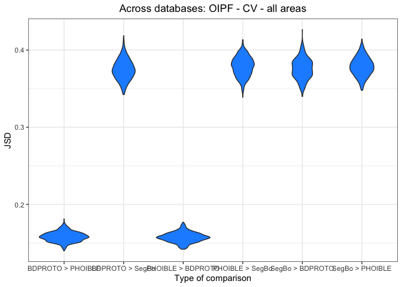<!-- -->

PHOIBLE and SegBo are drawn from a partially overlapping sample of
languages. Therefore, and similarity between the two could arise simply
because they contain the same languages. Let’s check to see how much
overlap there indeed is.

``` r
pho = droplevels(all_dbs_all_segments[all_dbs_all_segments$Database=="PHOIBLE",])
seg = droplevels(all_dbs_all_segments[all_dbs_all_segments$Database=="SegBo",])

common.langs = intersect(pho$Glottocode, seg$Glottocode)
length(common.langs)/length(unique(seg$Glottocode))
```

    ## [1] 0.5447471

As expected, a large number of inventories in SegBo come from languages
that also appear in PHOIBLE (\~50%). SegBo would only contribute the
borrowed segments for any language (and so not the entire inventory),
meaning that overlap is smaller than the number of shared languages
would suggest. Nevertheless, the most conservative test of the effects
of this overlap is to remove all shared languages and rerun the
analyses.

``` r
resampling.df.noOverlap = suppressMessages(iter.param(all_dbs_all_segments, k=500, distinctiveSegbo = T))

resampling.df.noOverlap$PtoQ = as.factor(apply(resampling.df.noOverlap[ ,cols], 1, paste, collapse = " > "))
```

Now we rerun the analyses in which we compared the frequencies of
segments across the corpora, this time making sure that the languages
involved are not shared between PHOIBLE and SegBo.

``` r
mod.dat.2 = all_dbs_all_segments[!all_dbs_all_segments$SegmentClass %in% c("tone", "vowel"),]

seg.fams = unique(mod.dat.2$family_id[mod.dat.2$Database=="SegBo"])
pho.fams = unique(mod.dat.2$family_id[mod.dat.2$Database=="PHOIBLE"])
bdproto.fams = unique(mod.dat.2$family_id[mod.dat.2$Database=="BDPROTO"])

intersect.fams = intersect(bdproto.fams, pho.fams)
intersect.fams = intersect(intersect.fams, seg.fams)

# Compute counts using only languages that are not shared between PHOIBLE and SegBo 
mod.dat.pho.seg = mod.dat.2 %>%
                  filter(!Glottocode %in% common.langs & 
                          Database != "BDPROTO" & 
                          family_id %in% intersect.fams) %>%
                  group_by(Database, Phoneme) %>%
                  summarize(Frequency=n()) %>%
                  spread(Database, Frequency) %>%
                  replace_na(list(PHOIBLE=0, SegBo=0))

mod.dat.bdproto = mod.dat.2 %>%
                  filter(Database == "BDPROTO" & 
                         family_id %in% intersect.fams) %>%
                  group_by(Phoneme) %>%
                  summarize(BDPROTO=n())

mod.dat.distinctive = left_join(mod.dat.pho.seg, mod.dat.bdproto, by="Phoneme") %>%
                      replace_na(list(BDPROTO=0))

# Scale the variables (sample sizes and scales are different; 
# this makes the numbers comparable)
mod.dat.distinctive$phoible.scaled = scaling.func(mod.dat.distinctive$PHOIBLE)
mod.dat.distinctive$bdproto.scaled = scaling.func(mod.dat.distinctive$BDPROTO)

mod.dat.distinctive.long = data.frame(Phoneme = rep(mod.dat.distinctive$Phoneme, 2), SegBo = rep(mod.dat.distinctive$SegBo, 2), Frequency.scaled = c(mod.dat.distinctive$phoible.scaled, mod.dat.distinctive$bdproto.scaled), Frequency.source = rep(c("PHOIBLE", "BDPROTO"), each=nrow(mod.dat.distinctive)))

#########################################################
# Modeling (7th order polynomial to match prior analyses)
#########################################################

# No overlap, all consonants
mod.nooverlap = glm(SegBo ~ poly(Frequency.scaled,7)*Frequency.source, data = mod.dat.distinctive.long, family="quasipoisson" )
summary(mod.nooverlap)
```

    ## 
    ## Call:
    ## glm(formula = SegBo ~ poly(Frequency.scaled, 7) * Frequency.source, 
    ##     family = "quasipoisson", data = mod.dat.distinctive.long)
    ## 
    ## Deviance Residuals: 
    ##     Min       1Q   Median       3Q      Max  
    ## -4.8205  -0.3080  -0.2971  -0.2623  11.9253  
    ## 
    ## Coefficients:
    ##                                                    Estimate Std. Error
    ## (Intercept)                                         -2.8572     0.2141
    ## poly(Frequency.scaled, 7)1                          44.5575     2.0904
    ## poly(Frequency.scaled, 7)2                         -37.1516     2.1223
    ## poly(Frequency.scaled, 7)3                          20.7879     1.8550
    ## poly(Frequency.scaled, 7)4                         -14.3213     1.6169
    ## poly(Frequency.scaled, 7)5                           6.7324     1.5470
    ## poly(Frequency.scaled, 7)6                          -1.3608     1.3113
    ## poly(Frequency.scaled, 7)7                          -0.3440     1.1259
    ## Frequency.sourcePHOIBLE                              0.1019     0.2918
    ## poly(Frequency.scaled, 7)1:Frequency.sourcePHOIBLE  -3.4527     2.9271
    ## poly(Frequency.scaled, 7)2:Frequency.sourcePHOIBLE   7.2174     3.0831
    ## poly(Frequency.scaled, 7)3:Frequency.sourcePHOIBLE  -7.9906     2.9695
    ## poly(Frequency.scaled, 7)4:Frequency.sourcePHOIBLE   8.0945     2.7574
    ## poly(Frequency.scaled, 7)5:Frequency.sourcePHOIBLE  -2.6639     2.5205
    ## poly(Frequency.scaled, 7)6:Frequency.sourcePHOIBLE  -2.3927     1.9328
    ## poly(Frequency.scaled, 7)7:Frequency.sourcePHOIBLE   0.9171     1.5834
    ##                                                    t value Pr(>|t|)    
    ## (Intercept)                                        -13.347  < 2e-16 ***
    ## poly(Frequency.scaled, 7)1                          21.316  < 2e-16 ***
    ## poly(Frequency.scaled, 7)2                         -17.506  < 2e-16 ***
    ## poly(Frequency.scaled, 7)3                          11.207  < 2e-16 ***
    ## poly(Frequency.scaled, 7)4                          -8.857  < 2e-16 ***
    ## poly(Frequency.scaled, 7)5                           4.352  1.4e-05 ***
    ## poly(Frequency.scaled, 7)6                          -1.038  0.29949    
    ## poly(Frequency.scaled, 7)7                          -0.306  0.75995    
    ## Frequency.sourcePHOIBLE                              0.349  0.72700    
    ## poly(Frequency.scaled, 7)1:Frequency.sourcePHOIBLE  -1.180  0.23828    
    ## poly(Frequency.scaled, 7)2:Frequency.sourcePHOIBLE   2.341  0.01931 *  
    ## poly(Frequency.scaled, 7)3:Frequency.sourcePHOIBLE  -2.691  0.00717 ** 
    ## poly(Frequency.scaled, 7)4:Frequency.sourcePHOIBLE   2.936  0.00336 ** 
    ## poly(Frequency.scaled, 7)5:Frequency.sourcePHOIBLE  -1.057  0.29066    
    ## poly(Frequency.scaled, 7)6:Frequency.sourcePHOIBLE  -1.238  0.21585    
    ## poly(Frequency.scaled, 7)7:Frequency.sourcePHOIBLE   0.579  0.56249    
    ## ---
    ## Signif. codes:  0 '***' 0.001 '**' 0.01 '*' 0.05 '.' 0.1 ' ' 1
    ## 
    ## (Dispersion parameter for quasipoisson family taken to be 2.790779)
    ## 
    ##     Null deviance: 8080.4  on 2685  degrees of freedom
    ## Residual deviance: 1829.1  on 2670  degrees of freedom
    ## AIC: NA
    ## 
    ## Number of Fisher Scoring iterations: 6

``` r
## Plotting results
hyp.data = expand.grid(Frequency.scaled = seq(0, 10), 
                       Frequency.source = c("PHOIBLE", "BDPROTO"))

preds.hyp = predict(mod.nooverlap, newdata=hyp.data, type="response", se.fit=T)

hyp.data = cbind(hyp.data,
                 SegBo = preds.hyp$fit, 
                 upper = preds.hyp$fit + preds.hyp$se.fit, 
                 lower = preds.hyp$fit - preds.hyp$se.fit)

hyp.data$Frequency.source = toupper(hyp.data$Frequency.source)

poisson.noOverlap.consonants = ggplot(hyp.data, aes(y=SegBo, x=Frequency.scaled, group=Frequency.source,  fill=Frequency.source)) + 
          geom_line() + 
          geom_ribbon(aes(ymin=lower,ymax=upper), alpha=0.7) +
          xlab("Inventory frequency (scaled)") +
          ylab("Predicted SegBo frequency") +
          scale_fill_manual(values=c("lightblue", "darkred"),
                            name="Database") +
          theme_bw()

poisson.noOverlap.consonants
```

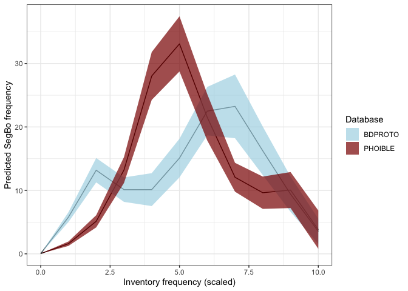<!-- -->

``` r
# No overlap, no labiodentals
mod.nooverlap.nold = glm(SegBo ~ poly(Frequency.scaled,7)*Frequency.source, data = mod.dat.distinctive.long[!mod.dat.distinctive.long$Phoneme %in% c("f", "v"),], family="quasipoisson" )
summary(mod.nooverlap.nold)
```

    ## 
    ## Call:
    ## glm(formula = SegBo ~ poly(Frequency.scaled, 7) * Frequency.source, 
    ##     family = "quasipoisson", data = mod.dat.distinctive.long[!mod.dat.distinctive.long$Phoneme %in% 
    ##         c("f", "v"), ])
    ## 
    ## Deviance Residuals: 
    ##     Min       1Q   Median       3Q      Max  
    ## -4.1274  -0.3084  -0.2976  -0.2576  12.1454  
    ## 
    ## Coefficients:
    ##                                                    Estimate Std. Error
    ## (Intercept)                                         -2.8856     0.2155
    ## poly(Frequency.scaled, 7)1                          43.4259     2.0670
    ## poly(Frequency.scaled, 7)2                         -36.1678     2.1629
    ## poly(Frequency.scaled, 7)3                          20.1019     1.9031
    ## poly(Frequency.scaled, 7)4                         -14.6286     1.6796
    ## poly(Frequency.scaled, 7)5                           8.3057     1.6090
    ## poly(Frequency.scaled, 7)6                          -3.1844     1.3559
    ## poly(Frequency.scaled, 7)7                           1.0785     1.1534
    ## Frequency.sourcePHOIBLE                              0.1242     0.2925
    ## poly(Frequency.scaled, 7)1:Frequency.sourcePHOIBLE  -3.4155     2.8847
    ## poly(Frequency.scaled, 7)2:Frequency.sourcePHOIBLE   6.9373     3.1187
    ## poly(Frequency.scaled, 7)3:Frequency.sourcePHOIBLE  -7.2984     2.9910
    ## poly(Frequency.scaled, 7)4:Frequency.sourcePHOIBLE   8.2494     2.7971
    ## poly(Frequency.scaled, 7)5:Frequency.sourcePHOIBLE  -4.4383     2.5546
    ## poly(Frequency.scaled, 7)6:Frequency.sourcePHOIBLE  -0.2189     1.9607
    ## poly(Frequency.scaled, 7)7:Frequency.sourcePHOIBLE  -0.4895     1.5996
    ##                                                    t value Pr(>|t|)    
    ## (Intercept)                                        -13.388  < 2e-16 ***
    ## poly(Frequency.scaled, 7)1                          21.009  < 2e-16 ***
    ## poly(Frequency.scaled, 7)2                         -16.722  < 2e-16 ***
    ## poly(Frequency.scaled, 7)3                          10.563  < 2e-16 ***
    ## poly(Frequency.scaled, 7)4                          -8.710  < 2e-16 ***
    ## poly(Frequency.scaled, 7)5                           5.162 2.62e-07 ***
    ## poly(Frequency.scaled, 7)6                          -2.349  0.01892 *  
    ## poly(Frequency.scaled, 7)7                           0.935  0.34983    
    ## Frequency.sourcePHOIBLE                              0.425  0.67111    
    ## poly(Frequency.scaled, 7)1:Frequency.sourcePHOIBLE  -1.184  0.23652    
    ## poly(Frequency.scaled, 7)2:Frequency.sourcePHOIBLE   2.224  0.02620 *  
    ## poly(Frequency.scaled, 7)3:Frequency.sourcePHOIBLE  -2.440  0.01475 *  
    ## poly(Frequency.scaled, 7)4:Frequency.sourcePHOIBLE   2.949  0.00321 ** 
    ## poly(Frequency.scaled, 7)5:Frequency.sourcePHOIBLE  -1.737  0.08243 .  
    ## poly(Frequency.scaled, 7)6:Frequency.sourcePHOIBLE  -0.112  0.91110    
    ## poly(Frequency.scaled, 7)7:Frequency.sourcePHOIBLE  -0.306  0.75964    
    ## ---
    ## Signif. codes:  0 '***' 0.001 '**' 0.01 '*' 0.05 '.' 0.1 ' ' 1
    ## 
    ## (Dispersion parameter for quasipoisson family taken to be 2.766931)
    ## 
    ##     Null deviance: 7002.9  on 2681  degrees of freedom
    ## Residual deviance: 1711.6  on 2666  degrees of freedom
    ## AIC: NA
    ## 
    ## Number of Fisher Scoring iterations: 6

``` r
## Plotting results
hyp.data = expand.grid(Frequency.scaled = seq(0, 10), 
                       Frequency.source = c("PHOIBLE", "BDPROTO"))

preds.hyp = predict(mod.nooverlap.nold, newdata=hyp.data, type="response", se.fit=T)

hyp.data = cbind(hyp.data,
                 SegBo = preds.hyp$fit, 
                 upper = preds.hyp$fit + preds.hyp$se.fit, 
                 lower = preds.hyp$fit - preds.hyp$se.fit)

hyp.data$Frequency.source = toupper(hyp.data$Frequency.source)

poisson.noOverlap.consonants.nold = ggplot(hyp.data, aes(y=SegBo, x=Frequency.scaled, group=Frequency.source,  fill=Frequency.source)) + 
          geom_line() + 
          geom_ribbon(aes(ymin=lower,ymax=upper), alpha=0.7) +
          xlab("Inventory frequency (scaled)") +
          ylab("Predicted SegBo frequency") +
          scale_fill_manual(values=c("lightblue", "darkred"),
                            name="Database") +
          theme_bw()

poisson.noOverlap.consonants.nold
```

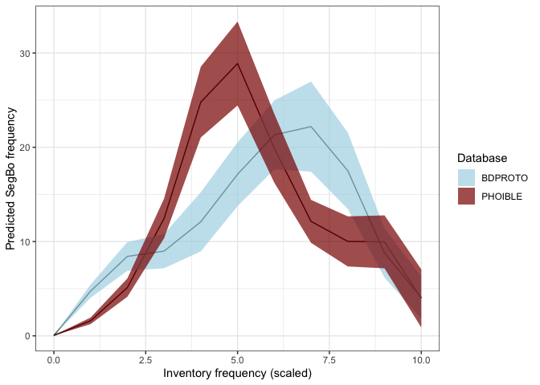<!-- -->

The results are nearly identical to the analysis over the full sample of
languages. Therefore, the differences between BDPROTO and PHOIBLE are
not subject to much interference from the overlap between PHOIBLE and
SegBo.

We are interested in the mean behavior of JSD under the different
resampling conditions. A first step is presented below, in which BDPROTO
and PHOIBLE are compared to SegBo (OSPL sampling, all macroareas, only
actual – not scrambled – segment counts, consonants and vowels). The
goal of this analysis is to determine whether PHOIBLE is significantly
more similar to SegBo than BDPROTO (indicating global pressure from
borrowability on the development of inventories over time).

``` r
library(visreg)

# Full inventories
mod.wOverlap.dat = resampling.df %>% filter(CompType=="True-True" & 
                                            macroarea!="all" & 
                                            SegmentClass=="consonant+vowel" &
                                            method=="ospl" &
                                            PtoQ %in% c("BDPROTO > SegBo",
                                                        "PHOIBLE > SegBo"))

cols = c("PtoQ", "macroarea")
mod.wOverlap.dat[cols] = lapply(mod.wOverlap.dat[cols], factor)
colnames(mod.wOverlap.dat)[4] = "Macroarea"

mod.wOverlap.dat$Macroarea = as.factor(ifelse(grepl("_", mod.wOverlap.dat$Macroarea, fixed=T), gsub("_", " ", mod.wOverlap.dat$Macroarea, perl=T), as.vector(mod.wOverlap.dat$Macroarea)))

mod.wOverlap = lm(JSD ~ PtoQ*Macroarea, data = mod.wOverlap.dat)
anova(mod.wOverlap)
```

    ## Analysis of Variance Table
    ## 
    ## Response: JSD
    ##                  Df Sum Sq Mean Sq  F value    Pr(>F)    
    ## PtoQ              1 32.345  32.345 11804.31 < 2.2e-16 ***
    ## Macroarea         5 98.500  19.700  7189.64 < 2.2e-16 ***
    ## PtoQ:Macroarea    5  2.174   0.435   158.68 < 2.2e-16 ***
    ## Residuals      5988 16.407   0.003                       
    ## ---
    ## Signif. codes:  0 '***' 0.001 '**' 0.01 '*' 0.05 '.' 0.1 ' ' 1

``` r
qqnorm(resid(mod.wOverlap))
```

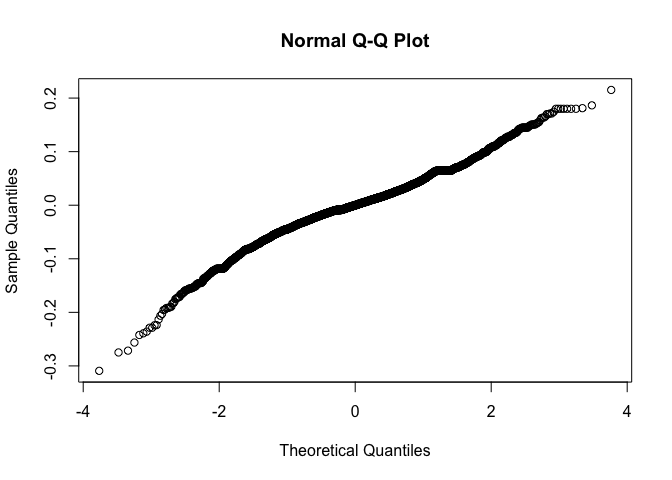<!-- -->

``` r
# Some alternative plots
visreg(mod.wOverlap, "PtoQ", by="Macroarea", overlay=T, gg=T) + xlab("Comparison")  + theme_bw()
```

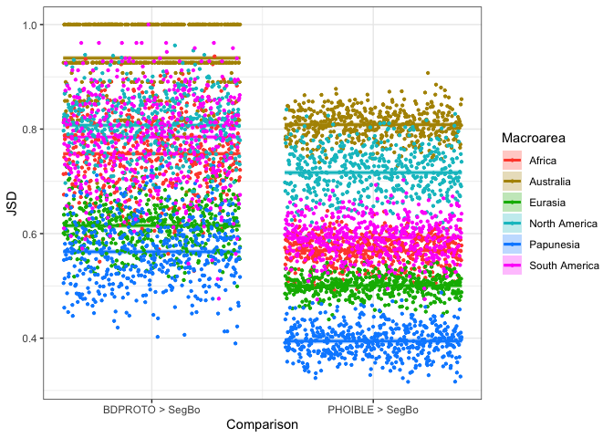<!-- -->

``` r
visreg(mod.wOverlap, "PtoQ", by="Macroarea", gg=T, partial=F, xlab = "Comparison") + xlab("") + theme_bw() + theme(axis.text.x = element_text(angle = 45,  hjust=1))
```

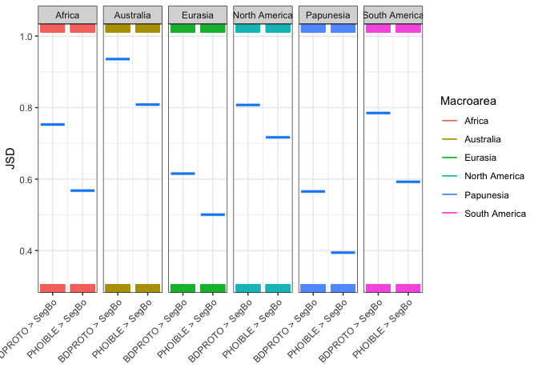<!-- -->

``` r
# No overlap between PHOIBLE and SegBo
resampling.df.noOverlap = resampling.df %>% unite("PtoQ", db.p:db.q, sep = " > ", remove = FALSE)
mod.noOverlap.dat = resampling.df.noOverlap %>% filter(CompType=="True-True" & 
                                                macroarea!="all" & 
                                                SegmentClass=="consonant+vowel" &
                                                method=="ospl" &
                                                PtoQ %in% c("BDPROTO > SegBo",
                                                        "PHOIBLE > SegBo"))

mod.noOverlap.dat[cols] = lapply(mod.noOverlap.dat[cols], factor)
colnames(mod.noOverlap.dat)[4] = "Macroarea"

mod.noOverlap.dat$Macroarea = as.factor(ifelse(grepl("_", mod.noOverlap.dat$Macroarea, fixed=T), gsub("_", " ", mod.noOverlap.dat$Macroarea, perl=T), as.vector(mod.noOverlap.dat$Macroarea)))

mod.noOverlap = lm(JSD ~ PtoQ*Macroarea, data = mod.noOverlap.dat)
anova(mod.noOverlap)
```

    ## Analysis of Variance Table
    ## 
    ## Response: JSD
    ##                  Df Sum Sq Mean Sq  F value    Pr(>F)    
    ## PtoQ              1 32.345  32.345 11804.31 < 2.2e-16 ***
    ## Macroarea         5 98.500  19.700  7189.64 < 2.2e-16 ***
    ## PtoQ:Macroarea    5  2.174   0.435   158.68 < 2.2e-16 ***
    ## Residuals      5988 16.407   0.003                       
    ## ---
    ## Signif. codes:  0 '***' 0.001 '**' 0.01 '*' 0.05 '.' 0.1 ' ' 1

``` r
qqnorm(resid(mod.noOverlap))
```

<!-- -->

``` r
# Some alternative plots
visreg(mod.noOverlap, "PtoQ", by="Macroarea", overlay=T, gg=T, xlab = "Comparison") + theme_bw()
```

<!-- -->

``` r
visreg(mod.noOverlap, "PtoQ", by="Macroarea", gg=T, partial=F, xlab = "Comparison") + theme_bw() + theme(axis.text.x = element_text(angle = 45, vjust = .75, hjust=1))
```

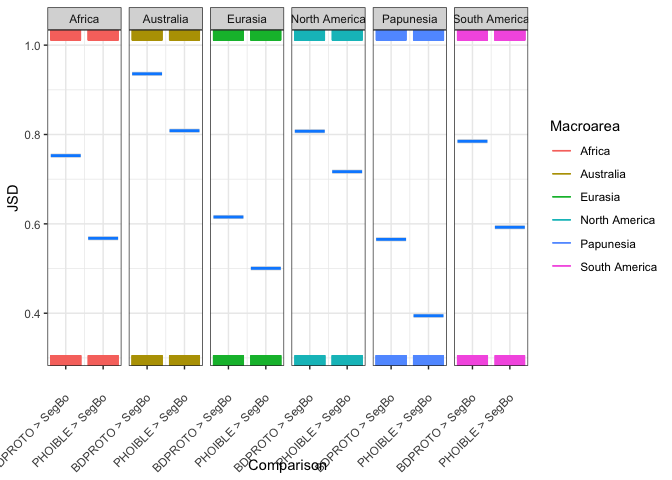<!-- -->

Plots for paper

``` r
#################
# Frequency plots 
#################
# Proportions per macroarea
p1.text = p.total.cts + theme(text = element_text(family="Times New Roman", size = 16)) +
              xlab("") +
              ylab("") +
              ggtitle("All segments") +
              coord_flip()

p2.text = p.consonant.cts + theme(text = element_text(family="Times New Roman", size = 16)) +
              xlab("") +
              ylab("") +
              theme(axis.text.y = element_blank()) +
              ggtitle("Consonants") +
              theme(axis.ticks.x = element_blank()) +
              coord_flip()

p3.text = p.vowel.cts + theme(text = element_text(family="Times New Roman", size = 16)) +
              xlab("") +
              ylab("") +
              theme(axis.text.y = element_blank()) +
              ggtitle("Vowels") +
              coord_flip()

plots = list(p1.text, p2.text, p3.text)

remove_axis = theme(axis.title.y = element_blank(), 
                    axis.text.y = element_blank(), 
                    axis.ticks.y = element_blank())

plots[-1] = lapply(plots[-1], function(.p){.p + remove_axis})

prop.plot = ggarrange(plots[[1]], plots[[2]], plots[[3]], nrow=1, ncol=3, common.legend=T, legend="right", widths = c(1.55,1,1))

prop.plot = annotate_figure(prop.plot,
                bottom = text_grob("Proportion of database (%)", 
                                   family="Times New Roman", size = 16),
                left = text_grob("Macroarea", 
                                 family="Times New Roman", rot = 90, size = 16))

ggsave("./plots_for_paper/prop_plot.tiff", plot = prop.plot, device="tiff", units = "in", height=7, width=10)

# Raw counts per corpus
p4.text = all.token.counts + ggtitle("All segments (tokens)") +
                             xlab("") +
                             ylab("") +
                             ylim(0, 100000) +
                             theme(plot.title = element_text(hjust = 0.5), 
                                   text = element_text(family="Times New Roman", size = 14))

p5.text = all.type.counts + ggtitle("All segments (types)") +
                             xlab("") +
                             ylab("") +
                             ylim(0, 3100) +
                             theme(plot.title = element_text(hjust = 0.5), 
                                   text = element_text(family="Times New Roman", size = 14))

p6.text = con.token.counts + ggtitle("Consonants (tokens)") +
                             xlab("") +
                             ylab("") +
                             ylim(0, 100000) + 
                             theme(plot.title = element_text(hjust = 0.5), 
                                   text = element_text(family="Times New Roman", size = 14))

p7.text = con.type.counts + ggtitle("Consonants (types)") +
                             xlab("") +
                             ylab("") +
                             ylim(0, 3100) +
                             theme(plot.title = element_text(hjust = 0.5), 
                                   text = element_text(family="Times New Roman", size = 14))

p8.text = vow.token.counts + ggtitle("Vowels (tokens)") +
                             xlab("") +
                             ylab("") +
                             ylim(0, 100000) +
                             theme(plot.title = element_text(hjust = 0.5), 
                                   text = element_text(family="Times New Roman", size = 14))

p9.text = vow.type.counts + ggtitle("Vowels (types)") +
                             xlab("") +
                             ylab("") +
                             ylim(0, 3100) +
                             theme(plot.title = element_text(hjust = 0.5), 
                                   text = element_text(family="Times New Roman", size = 14))

freq.plot = ggarrange(p4.text, p6.text, p8.text, p5.text, p7.text, p9.text, nrow=2, ncol=3)

freq.plot = annotate_figure(freq.plot,
                bottom = text_grob("Database", 
                                   family="Times New Roman", size = 16),
                left = text_grob("Frequency", 
                                 family="Times New Roman", rot = 90, size = 16))

ggsave("./plots_for_paper/freq_plot.tiff", plot = freq.plot, device="tiff", units = "in", height=7, width=10)

##################
# Poisson analysis 
##################
p10.text = poisson.consonants.all + ggtitle("All consonants") +
              ylab("") +
              xlab("") +
              theme(plot.title = element_text(hjust = 0.5), 
                    text = element_text(family="Times New Roman", size = 14))

p11.text = poisson.consonants.nold.all + ggtitle("No labiodentals") +
              ylab("") +
              xlab("") +
              theme(plot.title = element_text(hjust = 0.5), 
                    text = element_text(family="Times New Roman", size = 14))

p12.text = poisson.noOverlap.consonants + ggtitle("All consonants (no overlap)") +
              ylab("") +
              xlab("") +
              theme(plot.title = element_text(hjust = 0.5), 
                    text = element_text(family="Times New Roman", size = 14))

p13.text = poisson.noOverlap.consonants.nold + ggtitle("No labiodentals (no overlap)") +
              ylab("") +
              xlab("") +
              theme(plot.title = element_text(hjust = 0.5), 
                    text = element_text(family="Times New Roman", size = 14))

poisson.plot = ggarrange(p10.text, p11.text, p12.text, p13.text, legend="right", common.legend=T, nrow=2, ncol=2)

poisson.plot = annotate_figure(poisson.plot,
                bottom = text_grob("Frequency in BDPROTO/PHOIBLE", 
                                   family="Times New Roman", size = 16),
                left = text_grob("Predicted SegBo frequency", 
                                 family="Times New Roman", rot = 90, size = 16))

ggsave("./plots_for_paper/poisson_plot.tiff", plot = poisson.plot, device="tiff", units = "in", height=7, width=10)

# All segments
p14.text = poisson.all + theme(plot.title = element_text(hjust = 0.5), 
                    text = element_text(family="Times New Roman", size = 14))

ggsave("./plots_for_paper/poisson_plot_allsegs.tiff", plot = p14.text, device="tiff", units = "in", height=7, width=10)


##############
# JSD analysis
##############
jsd.plot = visreg(mod.wOverlap, "PtoQ", by="Macroarea", overlay=T, gg=T) + xlab("Comparison")  + theme_bw() + theme(text = element_text(family="Times New Roman", size = 14))

ggsave("./plots_for_paper/jsd_model_results.tiff", plot = jsd.plot, device="tiff", units = "in", height=7, width=10)

#######################################
# Distributions of resampled JSD (OSPL)
#######################################
ospl.sampling = distPlotter(resampling.df[resampling.df$PtoQ %in% c("BDPROTO > PHOIBLE", "BDPROTO > SegBo", "PHOIBLE > SegBo"),],
            "Across databases: OSPL - CV - all areas",
            "consonant+vowel", "all",
            "BDPROTO",
            "PHOIBLE",
            "ospl",
            "across",
            "True-True") + 
            theme(text = element_text(family="Times New Roman", size = 14))

ggsave("./plots_for_paper/jsd_raw_plot.tiff", plot = ospl.sampling, device="tiff", units = "in", height=7, width=10)
```

Save image

``` r
save.image("./jsd_session.Rdata")
```
